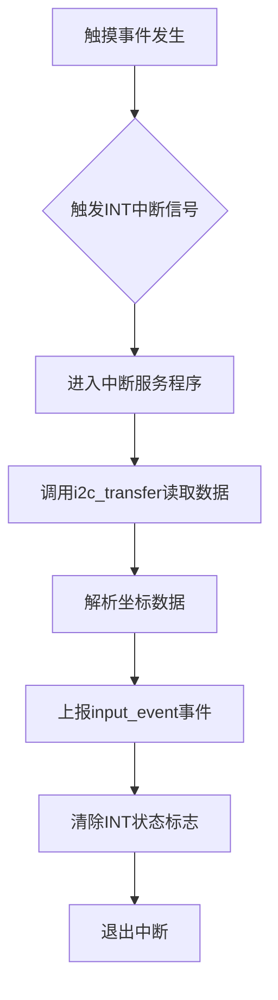

## 芯片简述

FT5426是一款支持TypeB类型多点触控的电容式触摸控制器

> - Type A：适用于触摸点不能被区分或者追踪
> - Type B：适用于有硬件追踪并能区分触摸点的触摸设备

该芯片需要关注的接口有两个：
- I2C接口，用于配置和获取数据
- 中断引脚，可配置为轮询模式或者触发模式，一般使用**触发模式**
  - 轮询模式： 存在触摸时持续拉低。
  - 触发模式： 持续按下时，在完成有效数据传输后会再次产生中断脉冲；中断频率由数据读取频率决定。

## 驱动设计

触摸屏事件的触发流程为：


````txt

````

> **触摸 -> 触发INT -> 进入中断 -> I2C读取数据：*i2c_transfer()* -> 汇报事件*input_event()* -> 退出中断**



