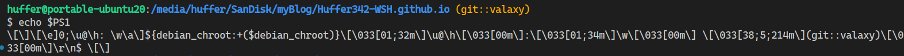

终端提示符的格式通过`PS1`环境变量控制。在终端中查看`PS1`
```sh
echo $PS1
```




一些简单的效果可以通过在`.bashrc`中修改PS1环境变量实现, 想要更多的功能可以使用`Oh-my-zsh`等工具实现。

关于终端提示符自定义的具体内容可以参考[《Bash/Prompt customization》](https://wiki.archlinux.org/title/Bash/Prompt_customization)

这里我列出我的`~/.bashrc`修改后的配置

```sh
GIT_PROMPT=$(git rev-parse --is-inside-work-tree >/dev/null 2>&1 && echo "(git::$(git symbolic-ref --short HEAD 2>/dev/null))")


END_PROMPT="\r\n\$ "

if [ "$color_prompt" = yes ]; then
    PS1='${debian_chroot:+($debian_chroot)}\[\033[01;32m\]\u@\h\[\033[00m\]:\[\033[01;34m\]\w\[\033[00m\] ''\[\033[38;5;214m\]'$GIT_PROMPT'\[\033[00m\]'$END_PROMPT
else
    PS1='${debian_chroot:+($debian_chroot)}\u@\h:\w '$GIT_PROMPT$END_PROMPT
fi
```

主要做了两处修改: **添加git仓库的信息**、**添加换行**

## 获取Git信息

查询是否是git仓库
```
git rev-parse --is-inside-work-tree
```

查询当前分支
```sh
git symbolic-ref --short HEAD
```

结合以上语句将仓库名保存到变量`GIT_PROMPT`中：

```sh
GIT_PROMPT=$(git rev-parse --is-inside-work-tree >/dev/null 2>&1 && echo "(git::$(git symbolic-ref --short HEAD 2>/dev/null))")
```

## 添加换行

当工作路径太长的时候，会把我们输的目录挤到一边，没敲几个词就换行。所以在PROMPT的结尾添加换行

```sh
END_PROMPT="\r\n\$ "
```
