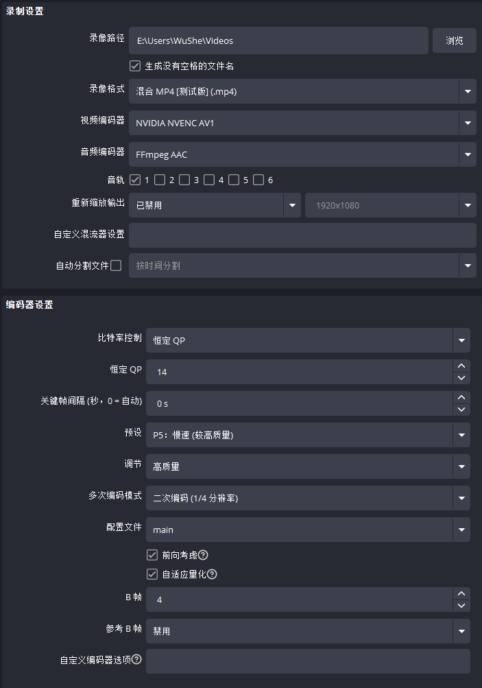
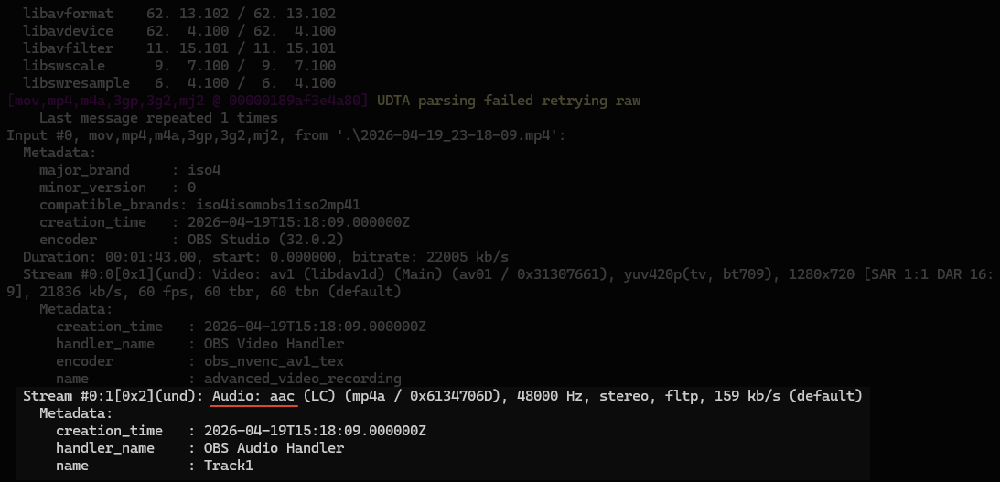

录制视频时，使用 CQP 码率控制可以优先保证画质；离线处理时，再用 CRF 重新编码，可以进一步减小文件体积。

如果录好的视频体积过大，需要发给别人，可以用 FFmpeg 重新编码一次。

## OBS 录制



## FFmpeg 下载

[FFmpeg-Builds@BtbN](https://github.com/BtbN/FFmpeg-Builds/releases)

一般下载文件名包含 [win64-gpl-shared.zip](https://github.com/BtbN/FFmpeg-Builds/releases/download/latest/ffmpeg-master-latest-win64-gpl-shared.zip) 的版本即可。

## 视频编码

通常可以选择 `libsvtav1`，使用 CPU 编码 AV1。它的压缩效果比较好，但速度偏慢，大约接近 1 倍速。

```sh
ffmpeg -ss 00:00:19 -to 00:01:03 -i input.mp4 -c:v libsvtav1 -crf 22 -preset 3 -c:a copy output.mp4
```

- `-ss` 起始时间
- `-to` 结束时间
- `-crf` 用于权衡画质和压缩率，数值越大，画质越低，文件越小。
- `-preset` 用于权衡编码速度和压缩率，数值越大，编码越快，文件通常也越大，并且会在一定程度上影响画质。

个人经验：

| 目标                     | crf | preset |
| ------------------------ | --- | ------ |
| 高质量优先               | 22  | 3      |
| 相机素材                 | 30  | 3      |
| 游戏录制                 | 35  | 3      |
| 轻量分享（组会、微信等） | 50  | 10     |

---

如果想提高编码速度，可以选择英伟达显卡的 HEVC 硬件编码。不过它不支持 CRF，压缩率通常不如 CPU 编码方案；目前我感觉英伟达显卡的 AV1 编码效果也不如 HEVC。

```sh
ffmpeg -i input.mp4 -c:v hevc_nvenc -preset p7 -rc vbr_hq -cq 23 -b:v 0 -c:a copy output.mp4
```

## 提取音频

如果只是提取音频，建议先查看原始音频格式，再用 `-c:a copy` 将音频流封装到合适的容器中。

```sh
ffmpeg -i input.mp4
```



```sh
ffmpeg -i input.mp4 -vn -c:a copy output.m4a
```

| 容器 / 扩展名        | 常见支持编码 | 备注                    |
| -------------------- | ------------ | ----------------------- |
| **MP3 (.mp3)**       | MP3          | 仅支持 MP3 编码         |
| **AAC / M4A (.m4a)** | AAC、ALAC    | 基于 MP4 容器的音频子集 |
| **FLAC (.flac)**     | FLAC         | 无损压缩专用            |
| **MKA (.mka)**       | 基本全兼容   |                         |

不指定编码器会根据文件扩展名自动选择编码器，也可以手动指定：

```sh
ffmpeg -i input.mp4 -vn -c:a libmp3lame -q:a 2 output.mp3
ffmpeg -i input.mp4 -vn -c:a flac output.flac
```
