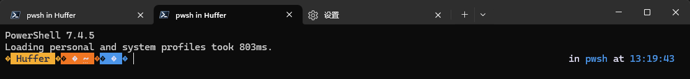
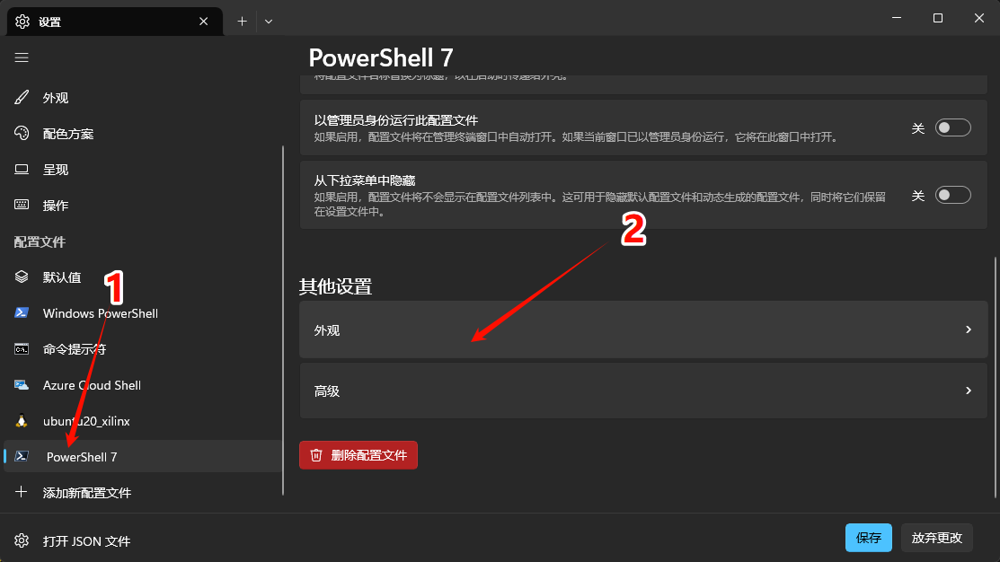
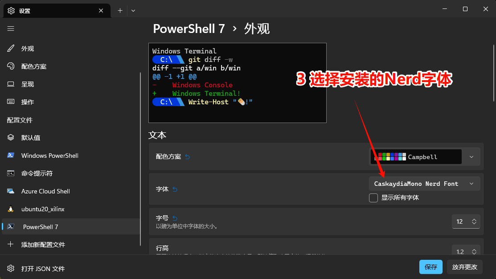
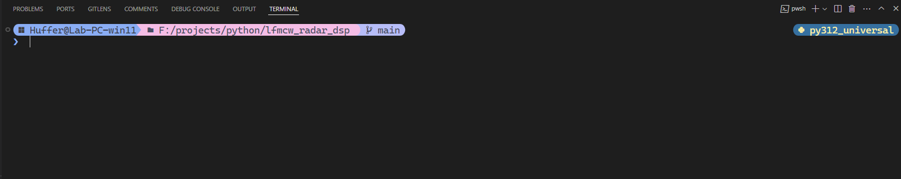

> windows下的类unix shell: [Nushell](https://github.com/nushell/nushell)、[Xonsh](https://github.com/xonsh/xonsh)、[Elvish](https://github.com/elves/elvish)（git starts排序）。由于常年被bash绑架，powershell用的很不习惯，还是优先选择这些类unix的shell吧

## 0. 精简版

1. 安装 `PSReadLine`,`oh-my-posh`,`posh-git`

   ```powershell
   Install-Module PSReadLine -Force -SkipPublisherCheck
   Set-ExecutionPolicy Bypass -Scope Process -Force; Invoke-Expression ((New-Object System.Net.WebClient).DownloadString('https://ohmyposh.dev/install.ps1'))
   Install-Module posh-git -Scope CurrentUser -Force
   ```
2. 打开PowerShell配置文件

   ```powershell
   # 打开配置文件
   notepad $PROFILE
   ```
3. 在配置文件中输入一下内容

   ```powershell
   # 设置文本编码
   [Console]::OutputEncoding = [System.Text.Encoding]::UTF8

   # 启动PSReadLine
   Import-Module PSReadLine
   Set-PSReadLineOption -EditMode Emacs
   Set-PSReadLineKeyHandler -Chord Ctrl+v -Function Paste
   Set-PSReadLineOption -PredictionSource History
   Set-PSReadLineOption -Colors @{
       Command            = 'Cyan'
       Parameter          = 'Yellow'
       String             = 'Green'
       Operator           = 'White'
       Number             = 'Magenta'
       Comment            = 'DarkGreen'
       ContinuationPrompt = 'DarkGray'
   }

   # oh-my-posh
   oh-my-posh init pwsh --config ~/AppData/Local/Programs/oh-my-posh/themes/my-theme.omp.json |    Invoke-Expression

   # posh-git
   Import-Module posh-git
   ```
4. 安装Nerd字体并修改终端的字体

   进这个网站下载一个Nerd字体并安装：[https://www.nerdfonts.com/](https://www.nerdfonts.com/)

   然后再使用的终端中修改字体，比如VSCode是在 `Settings`中的 `terminal.integrated.fontFamily`中修改

## 1. 修改powershell编码

中文的windows系统下的powershell默认编码是gbk，常常导致一些程序输出乱码(单片机用C语言是这样的)。windows里

下面的powershell指令检查当前的编码：

```powershell
[console]::OutputEncoding
```

如果不是 UTF-8，使用以下命令将输出编码设置为 UTF-8：

```powershell
[console]::OutputEncoding = [System.Text.Encoding]::UTF8
```

为了确保每次启动 PowerShell 时都将输出编码设置为 UTF-8，可以将设置写入 PowerShell 的 `profile` 文件。

- `AllUsersAllHosts`：为所有用户和所有 PowerShell 会话加载（位于 PowerShell 安装目录下）。
- `AllUsersCurrentHost`：为所有用户但仅在当前 PowerShell 主机中加载。
- `CurrentUserAllHosts`：为当前用户但在所有 PowerShell 会话中加载。
- `CurrentUserCurrentHost`：为当前用户且仅在当前 PowerShell 主机中加载。通常是指 `$PROFILE`，位于用户主目录下。
- 可以通过以下命令查看它们的位置：

  ```powershell
  $PROFILE | Format-List * -Force
  ```

  输出类似下面这样

  ```powershell
  AllUsersAllHosts       : C:\Windows\System32\WindowsPowerShell\v1.0\profile.ps1
  AllUsersCurrentHost    : C:\Windows\System32\WindowsPowerShell\v1.0\Microsoft.  PowerShell_profile.ps1
  CurrentUserAllHosts    : E:\Users\Huffer\Documents\WindowsPowerShell\profile.ps1
  CurrentUserCurrentHost : E:\Users\Huffer\Documents\WindowsPowerShell\Microsoft. PowerShell_profile.ps1
  Length                 : 76
  ```

一般选择CurrentUserCurrentHost这一项的文件就行了，指令 `$PROFILE` 默认打印CurrentUserCurrentHost配置文件的路径。

在文件中添加以下内容：

```powershell
[console]::OutputEncoding = [System.Text.Encoding]::UTF8
```

保存文件后，PowerShell 每次启动时都会自动应用这个设置。

## 2. 优化 PowerShell 补全

PowerShell的补全是一个一个轮流显示的，而不是bash那样根据上文补全的。`PSReadLine` 模块可以让 PowerShell 的体验更像 Linux 命令行一样。

PSReadLine的Github仓库链接： [https://github.com/PowerShell/PSReadLine](https://github.com/PowerShell/PSReadLine)

### 2.1 安装并加载 `PSReadLine` 模块

`PSReadLine` 通常预装在较新的 PowerShell 版本中。如果没有安装，可以使用以下命令安装：

```powershell
Install-Module PSReadLine -Force -SkipPublisherCheck
```

### 2.2 修改 PowerShell 配置

和上面一样，打开 `$PROFILE` 配置文件,添加一下内容

```powershell
Import-Module PSReadLine
Set-PSReadLineOption -EditMode Emacs
```

## 3. 安装 oh-my-posh 来美化powershell

> 2025/06/28更新，[Starship](https://starship.rs/)也可以美化，但仅仅是美化，没有插件

[Oh My Posh](https://ohmyposh.dev/)用于美化powershell，可以显示python环境以及git仓库信息之类的。

### 3.1 安装 Oh My Posh

```powershell
Set-ExecutionPolicy Bypass -Scope Process -Force; Invoke-Expression ((New-Object System.Net.WebClient).DownloadString('https://ohmyposh.dev/install.ps1'))
```

### 3.2 安装 Nerd 字体

[官网教程: https://ohmyposh.dev/docs/installation/fonts](https://ohmyposh.dev/docs/installation/fonts)

安装显示图标需要的[Nerd](https://www.nerdfonts.com/)字体,否则就会像下图这样，不能正常显示。我使用的是[CaskaydiaMonoNerdFontMono-Regular.ttf](https://github.com/ryanoasis/nerd-fonts/releases/download/v3.2.1/CascadiaMono.zip)



安装完成过后需要设置终端使用的字体，Windows Terminal的修改方式如下





VSCode的话再设置里搜索terminal.integrated.fontFamily

填上安装的字体就可以

### 3.3 powershell使用oh-my-posh并选择主题

打开powershell的配置文件，添加以下内容

```powershell
oh-my-posh init pwsh --config ~/AppData/Local/Programs/oh-my-posh/themes/my-theme.omp.json | Invoke-Expression
```

其中 `~/AppData/Local/Programs/oh-my-posh/themes/my-theme.omp.json`是主题配置文件的路径，我的主题是在[catppuccin主题](https://github.com/JanDeDobbeleer/oh-my-posh/blob/main/themes/catppuccin.omp.json)的基础上改过来的,链接：[my-theme.omp.json](https://github.com/Huffer342-WSH/myNotes/blob/main/guide/resource/my-theme.omp.json)

我的主题在VSCode里是下图的效果，会显示git和python环境的信息



## 4. 安装 posh-git 提供Git指令支持

安装

```powershell
Install-Module posh-git -Scope CurrentUser -Force
```

在 PowerShell 配置配置文件中添加以下内容以导入 `posh-git` 模块

```powershell
Import-Module posh-git
```
