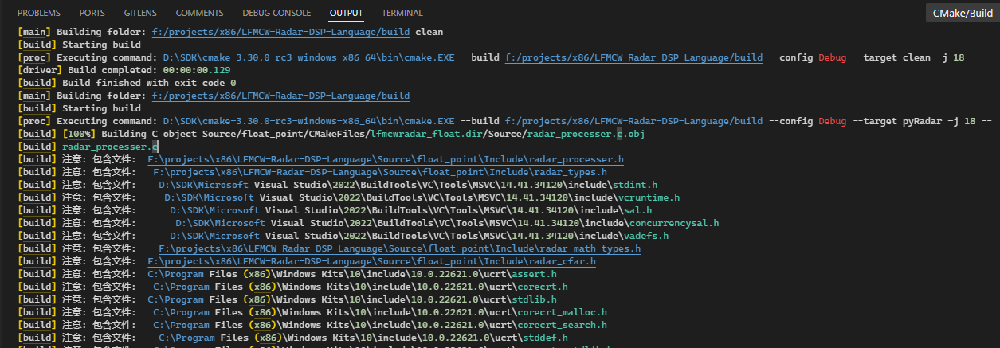
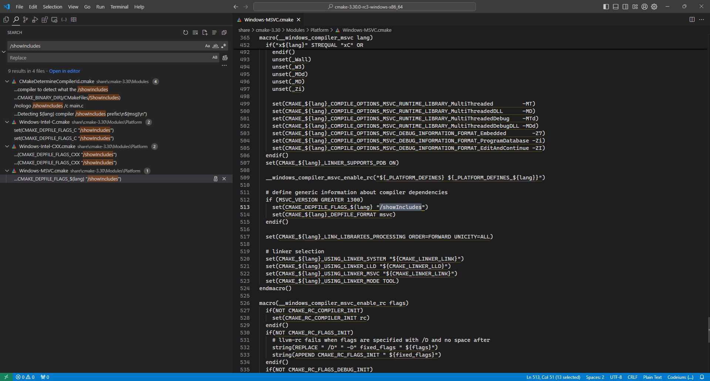

## 解决方案


```cmake
if(MSVC)
    message(STATUS "Using MSVC")

    # 关闭警告 C4819: 无效的字符。避免中文注释被警告
    add_compile_options(
        "/wd4819"
    )

    # 关闭 /showIncludes
    string(REPLACE "/showIncludes" "" CMAKE_DEPFILE_FLAGS_C "${CMAKE_DEPFILE_FLAGS_C}")
    string(REPLACE "/showIncludes" "" CMAKE_DEPFILE_FLAGS_CXX "${CMAKE_DEPFILE_FLAGS_CXX}")
endif()
```
## 解决过程

### 问题
CMake选择MSVC作为编译器时，构建目标会把include的头文件全都列出来，非常的烦人。


### 原因

去上网搜索以下可以知道这个编译时是启用了`/showIncludes`导致的。具体可以看微软的参考文档[《/showIncludes (List include files)》](https://learn.microsoft.com/en-us/cpp/build/reference/showincludes-list-include-files?view=msvc-170)

但是我并没有添加`/showIncludes`参数，那只能是CMake自己给我加上的了，到CMake的安装目录里去搜索`/showIncludes`文本，果然发现给我加了这个参数



```cmake
  if (MSVC_VERSION GREATER 1300)
    set(CMAKE_DEPFILE_FLAGS_${lang} "/showIncludes")
    set(CMAKE_${lang}_DEPFILE_FORMAT msvc)
  endif()
```

用mseeage打印以下这个变量就可以看到`/showIncludes`：
```cmake
message(STATUS "CMAKE_DEPFILE_FLAGS_C = ${CMAKE_DEPFILE_FLAGS_C}")
message(STATUS "CMAKE_DEPFILE_FLAGS_CXX = ${CMAKE_DEPFILE_FLAGS_CXX}")
```    

输出如下
```shell
[cmake] -- CMAKE_DEPFILE_FLAGS_C = /showIncludes
[cmake] -- CMAKE_DEPFILE_FLAGS_CXX = /showIncludes
```

### 解决

这样的话我们就在`CMAKE_DEPFILE_FLAGS_C`和`CMAKE_DEPFILE_FLAGS_CXX`里面去除`/showIncludes`就可以了，使用CMake的string命令中的`REPLACE`命令，格式如下：
```cmake
string(REPLACE <match_string> <replace_string> <output_variable> <input> [<input>...])
```

那从那两个变量里面去除`/showIncludes`的语句就是：
```cmake
string(REPLACE "/showIncludes" "" CMAKE_DEPFILE_FLAGS_C "${CMAKE_DEPFILE_FLAGS_C}")
string(REPLACE "/showIncludes" "" CMAKE_DEPFILE_FLAGS_CXX "${CMAKE_DEPFILE_FLAGS_CXX}")
```

把功能完善以下，顺便把中文注释报错也屏蔽一下，得到的CMake代码如下：

```cmake
if(MSVC)
    message(STATUS "Using MSVC")

    # 关闭警告 C4819: 无效的字符。避免中文注释被警告
    add_compile_options(
        "/wd4819"
    )

    # 关闭 /showIncludes
    string(REPLACE "/showIncludes" "" CMAKE_DEPFILE_FLAGS_C "${CMAKE_DEPFILE_FLAGS_C}")
    string(REPLACE "/showIncludes" "" CMAKE_DEPFILE_FLAGS_CXX "${CMAKE_DEPFILE_FLAGS_CXX}")
endif()
```
