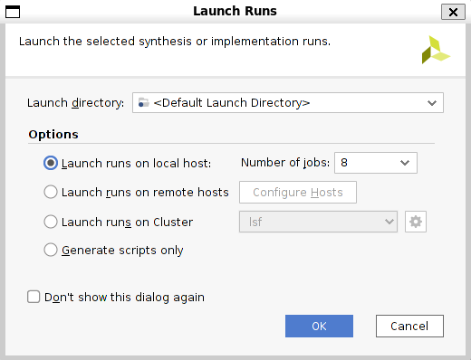
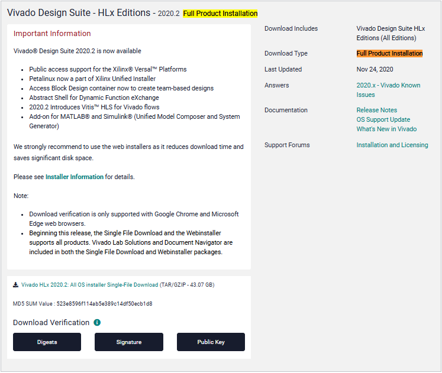
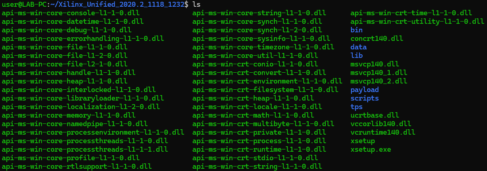
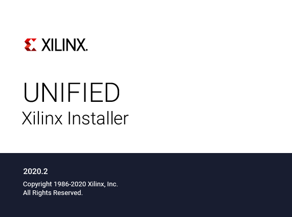

众所周知Vivado综合和布线非常的慢，而且windows下的vivado比linux里装的慢不少，不过可以使用高性能的远程主机加速编译，恰好实验室有一台装了ubuntu的工作站，因此想试一试。



结果我安装完vivado后发现，windwos下的vivado居然不支持这个功能，[官网文档](https://docs.amd.com/r/en-US/ug904-vivado-implementation/Using-Remote-Hosts-and-Compute-Clusters)的原话如下：
> Currently Linux is the only operating system Vivado supports for remote host configurations. Remote host settings are accessible through the Tools menu by selecting Tools > Settings > Remote Hosts.

当然我可以和以前一样去ubuntu下面工作，但是ubuntu用起来还是不太舒服，毕竟我也不是一直在工作，也是要干点其他事情的。所以我决定尝试在WSL里面装一个vivado试试，当然也可以用VMware虚拟机。

## 1. 安装/更新 WSL2

```
wsl --install
wsl --update
```

## 2. 在WSL2中安装Ubuntu20

可选系统挺多的，因为ubuntu20我用的多，所以就装这个了。

这里推荐一个WSL的管理工具 [wsl2-distro-manager](https://github.com/bostrot/wsl2-distro-manager)。

## 3. 使用APT安装需要的包

大概是只有在ubuntu会出现，安装Vivado会卡在“Generating installed device list”，这个问题在[《Vivado 2020.2 Installation stuck at "Generating installed device list" on UBUNTU 20.04LTS》](https://adaptivesupport.amd.com/s/question/0D52E00006hpRxQSAU/vivado-20202-installation-stuck-at-generating-installed-device-list-on-ubuntu-2004lts?language=en_US) 里面有解决方案。

```sh
sudo apt update
sudo apt install libncurses5-dev libncurses5 libtinfo-dev
```

ubuntu自带的是libncurses6，貌似太新了。毕竟IC这块很多还在用centos6，依赖都比较老也是正常的。

## 4. 安装GUI

Windows 10 版本 19044+ 或 Windows 11 的WSL支持GUI应用，推荐通过安装gedit来顺便安装GUI。

```sh
sudo apt install gedit
```

## 5. 下载Vivado并安装

我安装的是vivado2020.2，老版本的vivado可以在这里找到：[Vivado Archive](https://www.xilinx.com/support/download/index.html/content/xilinx/en/downloadNav/vivado-design-tools/archive.html)

下载“Full Product Installation”里面的安装包，网页右侧边栏的"Documentation -> Release Notes" 点进去有安装说明。




下载下来后是一个tar.gz压缩包，比如我的是“Xilinx_Unified_2020.2_1118_1232.tar.gz”。在Ubuntu系统里面解压（在WIndwos解压出来的，安装的时候会卡在启动界面）

```sh
tar -xvf ./Xilinx_Unified_2020.2_1118_1232.tar.gz -C ~/
```

cd进解压出来的文件夹里面后安装



```sh
./xsetup
```

然后就会弹出启动界面了



接下来就是正常的安装步骤了，这里跳过。


## 6. 配置vivado环境变量

在Vivado的安装目录下面有一个设置环境的脚本：settings64.sh。不止在Vivado下面有，Vitis、HLS的目录里都有。把里面的东西复制到`~/.profile`或者`/etc/profile`里，区别是一个是全局的，一个是单用户的。


## 7. WSL连接USB设备

[《连接 USB 设备》](https://learn.microsoft.com/zh-cn/windows/wsl/connect-usb)
