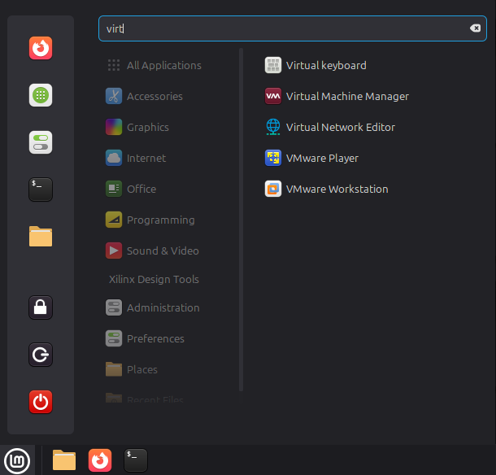
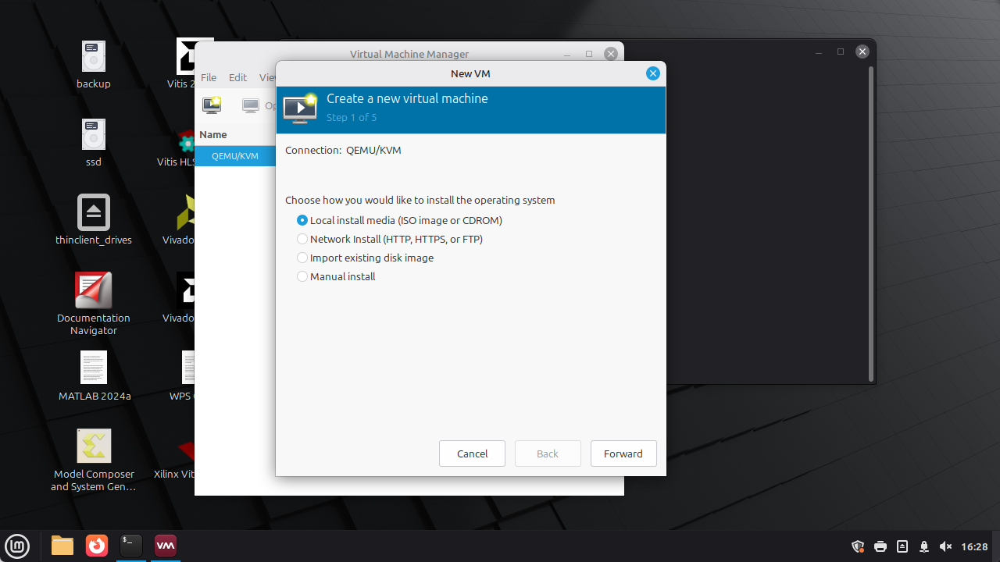
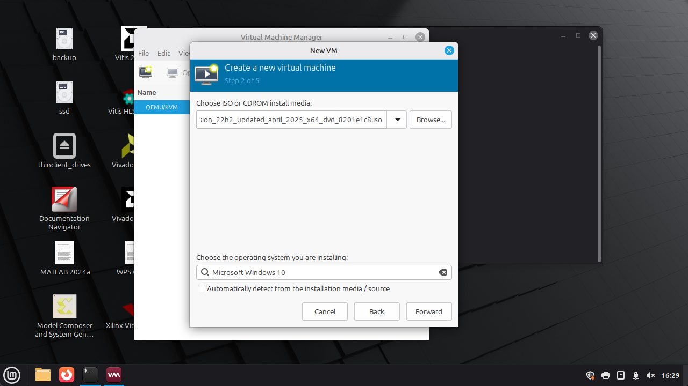
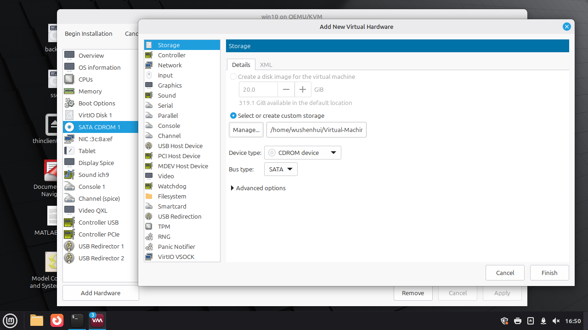
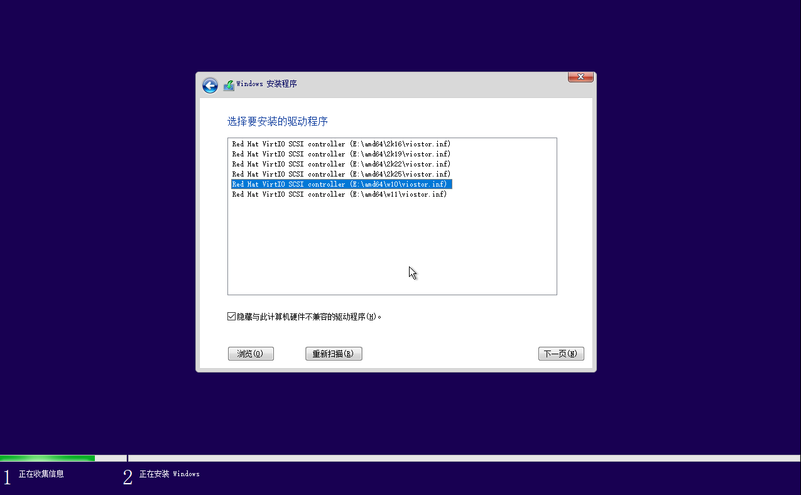

## 安装KVM


```bash
sudo apt update
sudo apt install qemu-kvm libvirt-daemon-system libvirt-clients bridge-utils virt-manager
```

安装完成后，检查服务状态：

```bash
systemctl status libvirtd
```


  将用户加入虚拟化组

```bash
sudo usermod -aG libvirt $USER
sudo usermod -aG kvm $USER
```

然后**注销或重启**生效。
> 或者`newgrp libvirt`


## 创建虚拟机

准备好windows 镜像和驱动


在github仓库[virtio-win-pkg-scripts@virtio-win](https://github.com/virtio-win/virtio-win-pkg-scripts)下载[Stable virtio-win ISO](https://fedorapeople.org/groups/virt/virtio-win/direct-downloads/stable-virtio/virtio-win.iso)


启动图形界面
```bash
virt-manager
```



---

# 五、准备 Windows 镜像

需要准备：

* Windows ISO（系统安装镜像）
* VirtIO 驱动（提高磁盘和网络性能）

👉 VirtIO 驱动建议下载：

* VirtIO Drivers

---

# 六、创建 Windows 虚拟机


## 1. 打开 virt-manager → 点击 “创建虚拟机”

选择：

* “本地安装媒体（ISO）”

## 2. 选择 Windows ISO

如果没有识别系统：

* 手动选择 Windows 版本（如 Windows 10/11）

---

## 3. 分配资源

建议最低配置：

* CPU：2 核以上
* 内存：4GB（建议 8GB）
* 磁盘：40GB+

---

## 4. 关键设置（非常重要）

在“自定义配置”中调整：

### 硬件 → 磁盘

* 总线类型改为：**VirtIO**

### 添加 → CD-ROM

* 挂载 VirtIO ISO（驱动盘）

---

# 七、安装 Windows









