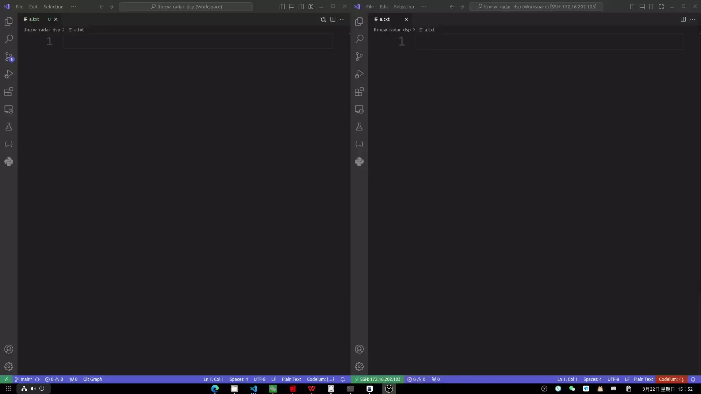
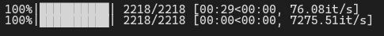
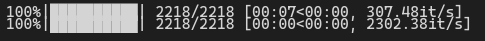

最近写python代码跑起来有点慢，想要使用服务器来跑。不过我有想要文件存在我的电脑上，所以选择使用NFS将本地文件挂载到远程服务器上，然后用VSCode连接远程服务器上写代码。


NFS（Network File System）是一种允许通过网络将文件系统挂载到远程服务器上的协议，使得多个主机可以像本地文件系统一样共享和访问文件。

Red Hat文档里有NFS的教程： [《Configuring the NFS Server》](https://docs.redhat.com/en/documentation/red_hat_enterprise_linux/7/html/storage_administration_guide/nfs-serverconfig#nfs-serverconfig-exports)
## 1. 环境准备
假设有两台设备：
- **服务端**：提供文件共享的主机（IP 为 `192.168.1.100`）
- **客户端**：访问共享文件的主机（IP 为 `192.168.1.101`）

## 2. 服务端配置

### 2.1 安装 NFS 服务
在服务端上安装 NFS 服务器所需的软件包：
```bash
sudo apt update
sudo apt install nfs-kernel-server
```

### 2.2 配置共享目录


选择需要共享的目录，假设我们需要将 `/mnt/share` 目录通过 NFS 共享：
```bash
sudo mkdir -p /mnt/share
sudo chown nobody:nogroup /mnt/share
```

然后，编辑 `/etc/exports` 文件，添加 NFS 共享配置：
```bash
sudo nano /etc/exports
```

在文件末尾添加以下内容：
```bash
/mnt/share 192.168.1.101(rw,async,no_subtree_check,no_wdelay)
```

`/etc/exports`文件中配置的内容的含义在Red Hat文档里有说明：[《21.7. The /etc/exports Configuration File》](https://docs.redhat.com/en/documentation/red_hat_enterprise_linux/5/html/deployment_guide/s1-nfs-server-config-exports),

此外，GoLinuxCloud 也提供了一些实用的例子:[《10 practical examples to export NFS shares in Linux
》](https://www.golinuxcloud.com/nfs-exports-options-examples/#8_Export_NFS_share_as_Read_Write_Mode)


---
**如果要挂载的目录位于一个ntfs文件系统中**，需要设置`no_root_squash`，比如：
```bash
/mnt/share 192.168.1.101(rw,async,no_root_squash,no_subtree_check)
```
否则客户端在挂载时会报错：
> mount.nfs: access denied by server while mounting

可能是由于 NTFS 和 Linux 本地文件系统（如`ext4`）的权限模型不同，导致权限冲突，`no_root_squash` 参数的作用是**允许NFS客户端以root用户的权限访问NFS服务器上的文件**。

---


### 2.3 应用更改
保存并退出文件后，重新启动 NFS 服务以使配置生效：
```bash
sudo exportfs -a
sudo systemctl restart nfs-kernel-server
```

## 3. 客户端配置

### 3.1 安装 NFS 客户端
在客户端上安装 NFS 客户端软件包：
```bash
sudo apt update
sudo apt install nfs-common
```

### 3.2 挂载远程共享目录
创建一个用于挂载共享目录的本地挂载点，例如 `/mnt/nfs`：
```bash
sudo mkdir -p /mnt/nfs
```

接下来，通过 NFS 挂载服务端的共享目录：
```bash
sudo mount 192.168.1.100:/mnt/share /mnt/nfs
```

### 3.3 验证挂载
使用 `df -h` 或 `mount` 命令查看挂载情况，确认 NFS 共享已成功挂载：
```bash
df -h
```
如果看到 `/mnt/nfs` 挂载到 `192.168.1.100:/mnt/share`，则表示成功。

## 4. 防火墙设置

NFS 需要开放一定的网络端口才能正常通信，因此我们需要配置防火墙。默认情况下，NFS 使用以下端口：
- **TCP/UDP 2049**: NFS 主服务端口

### 4.1 服务端防火墙设置
在服务端上，使用以下命令允许 NFS 所需的端口：
```bash
sudo ufw allow from 192.168.1.101 to any port nfs
```
这条命令允许来自 `192.168.1.101` 的客户端通过 NFS 协议访问服务端。

### 4.2 客户端防火墙设置
客户端通常不需要特别配置防火墙来使用 NFS，但如果客户端有入站规则限制，确保相关端口允许通信。

## 5. 自动挂载

如果希望客户端在每次重启时自动挂载远程 NFS 共享，可以编辑 `/etc/fstab` 文件，添加以下行：
```bash
192.168.1.100:/mnt/share /mnt/nfs nfs defaults 0 0
```

## 6. 卸载 NFS 共享
如果需要卸载已挂载的 NFS 目录，使用以下命令：
```bash
sudo umount /mnt/nfs
```

## 7. 效果展示

我将本地电脑作为服务端，将我的项目文件挂载到服务器上。VSCode通过SSH连接到服务器上，效果如下图所示。索然我启用了异步和延迟写入，但是这个延迟也是可以接受的，基本不会出现没保存成功的情况。



在本地和服务器上分别跑一下用joblib并行化的代码，结果如下：

<div style="display: flex; justify-content: space-around;">
    <div style="text-align: center;">
        
        <p>Local Result</p>
    </div>
    <div style="text-align: center;">
        
        <p>Server Result</p>
    </div>
</div>

可惜服务器上跑也就快了3倍多一点吗。
