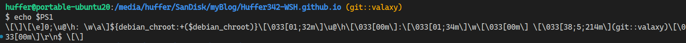

没有shell兼容问题时，建议使用[zsh](https://www.zsh.org/)和[Oh My Zsh](https://github.com/ohmyzsh/ohmyzsh)。


## 简单修改

终端提示符的格式通过`PS1`环境变量控制。在终端中查看`PS1`
```sh
echo $PS1
```



> 关于端提示符自定义的具体内容可以参考[《Bash/Prompt customization》](https://wiki.archlinux.org/title/Bash/Prompt_customization)
>
一些简单的效果可以通过在`.bashrc`中修改PS1环境变量实现，例如我需要的是git信息+结尾换行，添加下面的代码到`~/.bashrc`

```sh
# 添加$(git_prompt)到PS1
function git_prompt() {
    git rev-parse --is-inside-work-tree &>/dev/null || return

    branch=$(git symbolic-ref --short HEAD 2>/dev/null || git rev-parse --short HEAD)
    is_detached=! git symbolic-ref -q HEAD &>/dev/null
    has_changes=! git diff --quiet &>/dev/null && echo "*"

    if [ "$1" == "color" ]; then
        # 颜色定义
        RED="\[\e[31m\]"
        GREEN="\[\e[32m\]"
        YELLOW="\[\e[33m\]"
        CYAN="\[\e[36m\]"
        RESET="\[\e[0m\]"

        # 状态判断
        if $is_detached && [ -n "$has_changes" ]; then
            color=$YELLOW
        elif $is_detached; then
            color=$CYAN
        elif [ -n "$has_changes" ]; then
            color=$YELLOW
        else
            color=$GREEN
        fi

        echo " ${color}${branch}${has_changes}${RESET}"
    else
        echo " ${branch}${has_changes}"
    fi
}

GIT_PROMPT=$(git_prompt color)
END_PROMPT="\r\n❯ "
```

然后将`$GIT_PROMPT`和`$END_PROMPT`添加到`~/.bashrc`中的`PS1`中就行


## Oh My BASH!

Oh-My-Bash提供主题、常见应用的自动补全、插件等功能

## ble.sh

[https://github.com/akinomyoga/ble.sh](https://github.com/akinomyoga/ble.sh)


ble.sh替换了bash的命令行编辑器，从而提供更高级的补全以及vim/emacs
