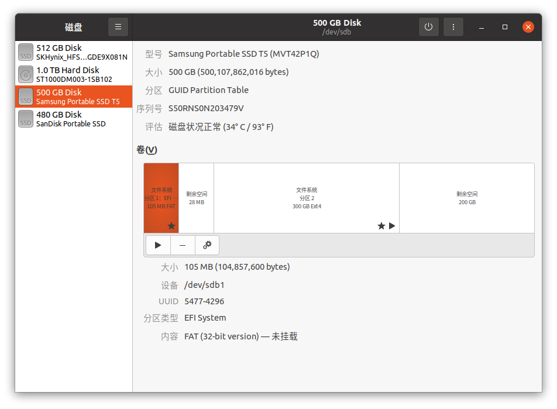

捣鼓往移动硬盘里装系统的时候一不小心把系统引导搞丢了，导致一开机就进了Grub的命令行界面，而不是正常的选系统界面。这个时候我的系统已经装在硬盘里了，只不过引导出了问题，所以可以在Grub的命令行界面手动引导系统。

<!-- more -->
参考资料: [How can I reinstall GRUB to the EFI partition?](https://askubuntu.com/questions/831216/how-can-i-reinstall-grub-to-the-efi-partition)

1. **挂载Ubuntu系统分区**：
   这一步挂载你的Ubuntu根分区。你需要根据系统的实际情况来指定正确的Ubuntu分区。可以打开“磁盘”软件来查看原来的系统在那个分区里：




   ```bash
   sudo mount /dev/sdXn /mnt
   ```
   其中，`/dev/sdXn` 是你的Ubuntu系统分区。

2. **挂载EFI分区**：
   接下来需要挂在EFT分区，GRUB和Windwos Boot Manager都是安装在这个分区的。这个分区一般都是硬盘的第一个分区，分区类型是‘EFI System’

   ```bash
   sudo mount /dev/sdY1 /mnt/boot/efi
   ```
   其中，`/dev/sdY1` 是你的EFI分区。

3. **挂载必要的文件系统**：

   为了确保chroot环境中的命令能正常工作，需要将当前系统的设备、进程和系统信息文件系统挂载到新环境中。
   ```bash
   for i in /dev /dev/pts /proc /sys /run; do sudo mount -B $i /mnt$i; done
   ```

4. **切换到新根目录**：
   使用 `chroot` 命令把根目录换成指定的目的目录，这样你可以像在正常的Ubuntu系统中一样执行命令。
   
   ```bash
   sudo chroot /mnt
   ```

5. **安装GRUB到指定硬盘**：
   在chroot环境下，运行 `grub-install` 来将GRUB安装到指定的硬盘。你需要根据你的系统设置指定正确的硬盘设备，例如 `/dev/sda` 或其他。
   ```bash
   grub-install /dev/sdX
   ```
   其中，`/dev/sdX` 是你的硬盘（而不是分区）。

6. **更新GRUB配置文件**：
   安装完GRUB后，建议更新GRUB配置文件以确保它正确识别系统中的操作系统。
   ```bash
   update-grub
   ```

7. **退出chroot并卸载挂载的文件系统**：
   完成所有操作后，退出chroot并卸载之前挂载的文件系统。
   ```bash
   exit
   sudo umount -R /mnt
   ```

8. **重启系统**：
   最后，从LiveCD中退出并重新启动计算机，系统应该可以正常引导。
