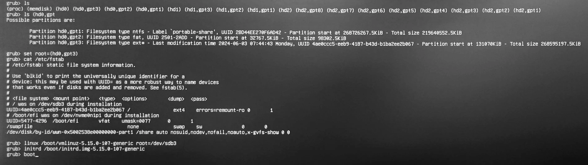

捣鼓往移动硬盘里装系统的时候一不小心把系统引导搞丢了，导致一开机就进了Grub的命令行界面，而不是正常的选系统界面。这个时候我的系统已经装在硬盘里了，只不过引导出了问题，所以可以在Grub的命令行界面手动引导系统。

<!-- more -->

引导系统分为两步：**加载内核**和**初始化RAM盘**。

## 精简版

一共四条指令，关键是得找到自己系统装在哪个分区里。

```shell
set root=(hd3,gpt3)
linux /boot/vmlinuz-5.15.0-107-generic root=/dev/sdb3
initrd /boot/initrd.img-5.15.0-107-generic
boot
```

## 0. 设置根路径(可选)

```shell
set root=(hdx,gptx)
```
假如跳过了这一步，下文写路径的时候就要加上`(hdx,gptx)`

可以使用`ls`命令+`tab键`查看分区信息，找到linux根目录所在分区（注意，直接tab看可选项，不用回车）

```shell
ls (hd0,gpt1
```
输出如下图


可以看到第三个`ext*`类型的分区就是linux的根目录所在分区。

接着输入

```shell
set root=(hd3,gpt3)
```

根目录就设置完成了

## 1. 加载内核
加载内核的指令格式如下

```shell
linux /path/to/<内核映像文件> root=/dev/<根目录分区>
# 一般是 linux /boot/vmlinuz-*-*-generic root=/dev/sd??
# 如果是nvme硬盘的话， root=/dev/nvme?n?p?
```

内核映像文件靠tab补全就行，根目录分区可以查看`/etc/fstab`文件得到，用`cat`命令查看

```shell
cat /etc/fstab
```


可以看到输出`# / was on /dev/sdb3 during installation.`，说明根目录在`/dev/sdb3`，所以`root=/dev/sdb3`。

最终得到

```shell
linux /boot/vmlinuz-5.15.0-107-generic root=/dev/sdb3
```


### 

## 2. 初始化RAM盘

```shell
initrd  /path/to/<initramfs镜像文件>
# initrd /boot/initrd.img-*-*-generic
```

initramfs镜像文件和内核映像文件类似，靠tab补全就行，一般都是放在`/boot`目录下，比如我的例子是

```shell
initrd /boot/initrd.img-5.15.0-107-generic
```

## 3.最后一步—— boot

输入`boot`启动系统

```shell
boot
```
## 完整截图



## 进了系统后怎么修复引导

一般就这两个指令默认参数就行

```shell
sudo grub-install
sudo update-grub
```
