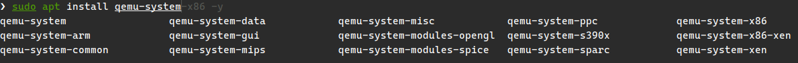

该文记录一个在qemu中运行linux的简单案例。过程为：

1. 编译安装qemu-system-riscv64
2. 编译OpenSBI
3. 编译Linux kernel
4. 使用Buildroot构建rootfs
5. 启动

## 1. 编译安装QEMU

大部分架构的qemu可以用apt安装，但是riscv目前需要手动编译安装。



### 准备构建环境

[官方文档：《Setup build environment》](https://www.qemu.org/docs/master/devel/build-environment.html)

```sh
sudo apt build-dep qemu
```

### 下载解压
```sh
wget https://download.qemu.org/qemu-10.1.1.tar.xz
tar -xf ./qemu-10.1.1.tar.xz
```

### 配置并构建
```sh
cd qemu-10.1.1
mkdir build && cd build
../configure --enable-slirp --target-list=riscv64-softmmu --prefix=/opt/qemu-10.1.1
make -j16
```

其中`--prefix=/opt/qemu-10.1.1`用于指定安装位，可选。安装到其他位置后需要

### 安装
```sh
sudo make install
```

## 2. 编译OpenSBI

### 安装编译器

```sh
sudo apt install gcc-riscv64-linux-gnu g++-riscv64-linux-gnu
```

### 编译

```sh
make CROSS_COMPILE=riscv64-linux-gnu- PLATFORM=generic all -j
```

产物生成在`platform/generic/firmware/`目录下

## 3. 编译Linux内核

### 准备构建环境
```sh
sudo apt install build-essential libncurses5-dev libncursesw5-dev \
                 libssl-dev flex bison libelf-dev dwarves -y
```

### 下载源码

[发布页](https://www.kernel.org/)

```sh
wget https://cdn.kernel.org/pub/linux/kernel/v6.x/linux-6.17.3.tar.xz
tar -xvf ./linux-6.17.3.tar.xz
```

### 设置环境变量（也可以跟在make指令后面）

```sh
export ARCH=riscv
export CROSS_COMPILE=riscv64-linux-gnu-
```

### 配置并编译

```sh
make defconfig
make -j
```

## 4. 使用Buildroot构建rootfs

1. 修改ARCH为RISCV
   ```
   Prompt: RISCV
     Location:
       -> Target options
         -> Target Architecture (<choice> [=y])
   ```

2. rootfs镜像把cpio勾上
   ```
   Prompt: cpio the root filesystem (for use as an initial RAM filesystem)
   Location:
       -> Filesystem images
   ```


## 5. 运行

```sh
qemu-system-riscv64 -M virt -smp 4 -m 4G \
    -bios ./opensbi/build/platform/generic/firmware/fw_jump.bin \
    -kernel ./linux-6.17.3/arch/riscv/boot/Image \
    -initrd ./buildroot-2025.08.1/output/images/rootfs.cpio \
    -append "root=/dev/ram" \
    -display none -serial stdio \
    -device virtio-scsi-device \
    -device virtio-net-pci,netdev=net0 \
    -netdev user,id=net0
```

## 6. 调试

待续
