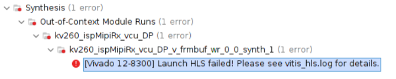
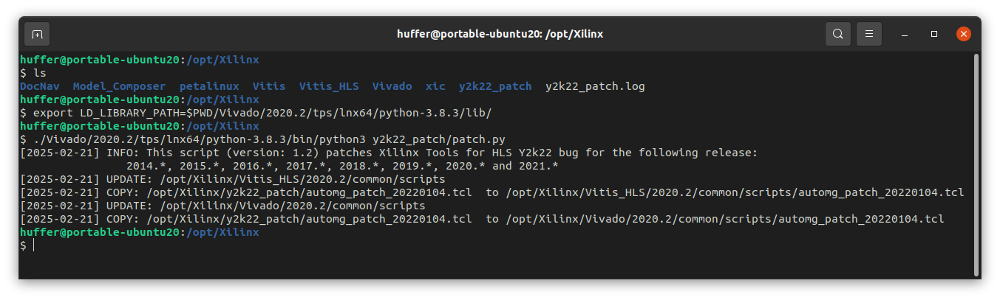

## 传送门

[《导出 IP 无效，实参/版本号溢出问题 (Y2K22)》](https://adaptivesupport.amd.com/s/article/76960?language=zh_CN)

## 问题描述

- Vivado版本： 2020.2
- 系统版本：    ubuntu20.04



根据指示打开`vitis_hls.log`后包含

```
source run_ippack.tcl -notrace
bad lexical cast: source type value could not be interpreted as target
    while executing
"rdi::set_property core_revision 2502211736 {component component_1}"
    invoked from within
"set_property core_revision $Revision $core"
    (file "run_ippack.tcl" line 1173)
INFO: [Common 17-206] Exiting Vivado at Fri Feb 21 17:37:03 2025...
ERROR: [IMPL 213-28] Failed to generate IP.
```


## 解决方法

AMD支持网页 [《导出 IP 无效，实参/版本号溢出问题 (Y2K22)》](https://adaptivesupport.amd.com/s/article/76960?language=zh_CN)里有详细的问题描述和解决方法。

---

这个BUG是因为HLS工具用一个32位整数来保存版本信息，导致21年以前的版本在2022.1.1之后都会导致溢出然后报错。

下载[《导出 IP 无效，实参/版本号溢出问题 (Y2K22)》](https://adaptivesupport.amd.com/s/article/76960?language=zh_CN)网页最下面的文件，连着文件夹一起解压到Xilinx安装目录，然后从README里找到对应版本的命令行操作就行。

我的执行结果如下：


