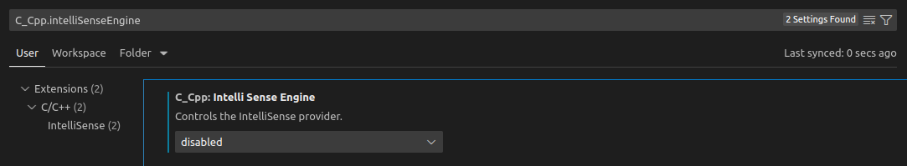
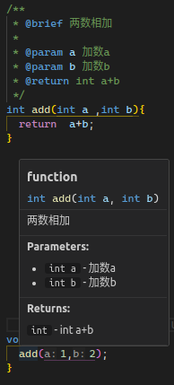
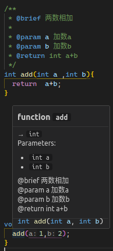
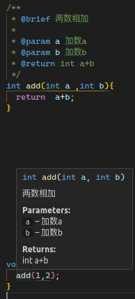

1. 安装 Clangd 插件
2. 生成`compile_commands.json`文件
3. 额外设置

## 1. 安装 Clangd 插件

[llvm-vs-code-extensions.vscode-clangd](https://marketplace.visualstudio.com/items?itemName=llvm-vs-code-extensions.vscode-clangd)


假如同时使用`ms-vscode.cpptools`插件则需要关闭[C_Cpp.intelliSenseEngine](vscode://settings/C_Cpp.intelliSenseEngine)



### 使用优化的clangd

[Doxygen parsing missing #529](https://github.com/clangd/clangd/issues/529)

当前版本的clangd对doxygen没有渲染，在tcottin的fork[tcottin/llvm-project:rearrange-hover](https://github.com/tcottin/llvm-project/tree/rearrange-hover)上新增了该功能，并已经开始pr流程了

可以先拉取他的branch编译一个clangd，下载并编译：
```sh
git clone https://github.com/tcottin/llvm-project.git --depth=1 --branch=rearrange-hover
cd llvm-project
mkdir build
cmake -S ./llvm -B ./build -DCMAKE_BUILD_TYPE=Release -DLLVM_ENABLE_PROJECTS="clang;clang-tools-extra" -DCMAKE_INSTALL_PREFIX=/path/to/your/install_dir
cmake --build ./build --target clangd -j
cmake --build ./build --target check-clangd -j #测试（可选）
sudo cmake --install ./build --component clangd
```

修改VSCode中的路径设置[clangd.path](vscode://settings/clangd.path)

<div style="display: flex; justify-content: space-around; align-items: center; gap: 10px; flex-wrap: wrap;">
  <div style="flex: 1 1 10px; text-align: center;">
    
    <p><strong>clangd-opt</strong></p>
  </div>
  <div style="flex: 1 1 10px; text-align: center;">
    
    <p><strong>clangd</strong></p>
  </div>
  <div style="flex: 1 1 10px; text-align: center;">
    
    <p><strong>c_cpp</strong></p>
  </div>
</div>

## 2. 生成`compile_commands.json`文件

[官网文档](https://clangd.llvm.org/design/compile-commands)
[《JSON Compilation Database Format Specification》](https://clang.llvm.org/docs/JSONCompilationDatabase.html)

### 2.1 CMake

- 如果使用命令行操控CMake, 配置时添加[-DCMAKE_EXPORT_COMPILE_COMMANDS=ON](https://cmake.org/cmake/help/latest/variable/CMAKE_EXPORT_COMPILE_COMMANDS.html)，如：
    ```cmake
    cmake -S . -B ./build -DCMAKE_EXPORT_COMPILE_COMMANDS=ON
    ```
- 如果在使用VSCode的插件`ms-vscode.cmake-tools`来操控CMake，打开该设置：[cmake.exportCompileCommandsFile](vscode://settings/cmake.exportCompileCommandsFile)

### 2.2 Makefile

很多老项目使用Makefile维护，此时需要借助[Bear](https://github.com/rizsotto/Bear)或者[compiledb(支持windows)](https://github.com/nickdiego/compiledb)，以及一些项目自带的工具

- Bear通过拦截编译器调用捕获编译参数
- compiledb通过解析Make输出捕获编译指令，复杂的项目无法使用

#### 2.2.1 Bear

**安装**

包管理器/编译

**使用**

以Linux内核为例子：

```sh
make O=build x86_64_defconfig
bear make O=build -j
```

项目包含多个make时添加`--append`参数
```
bear --append --output ../compile_commands.json -- make -j
```
> bear2.4.3 和 3.x使用方法有差别，详见--help

#### 2.2.2 compiledb

compiledb只适用于Makefile构建方式比较常规的项目，向Linux内核就不能使用。

#### 2.2.3 其他

Linux 内核中的 `scripts/clang-tools/gen_compile_commands.py`，可以在编译代码后生成`compile_commands.json`

### 2.3 Bazel

[bazel-compile-commands-extractor](https://github.com/hedronvision/bazel-compile-commands-extractor)

## 3. 额外设置

在 VSCode 的 `settings.json`/`.code-workspace` 文件中添加以下配置：

```json
"clangd.arguments": [
    // 禁用代码补全时自动插入 #include 指令。
    "--header-insertion=never",
    // 启用 clang-tidy 诊断功能，用于静态分析代码问题。
    "--clang-tidy",
    // 在后台索引项目代码，并将索引持久化到磁盘。
    "--background-index",
    // 设置日志级别为 "error"，仅显示错误信息。
    "--log=error",
    // 将预编译头 (PCH) 存储在内存中以提高性能。
    "--pch-storage=memory",
    // 启用定期释放内存功能，调用 malloc_trim(3)。
    "--malloc-trim"
]
```

## 4. 其他问题

### 4.1 riscv架构的工程clangd不工作

创建 `.clangd` 文件，忽略 clangd 不支持的参数：

```yaml
CompileFlags:
  Remove: [-march=*, -mabi=*, -mcpu=*]
```

**.clangd**位置：

- **项目配置**：源代码树中名为 .clangd 的文件。（clangd 会在活动文件的所有父目录中搜索）。
  - 通常用于共享和提交的设置。
  - （现有名为 .clangd 的目录可以删除。这些目录在 clangd 11 之前用于临时存储）。
- **用户配置**：OS 特定目录中的 config.yaml 文件：
  - **Windows**：`%LocalAppData%\clangd\config.yaml`，通常是 `C:\Users\Bob\AppData\Local\clangd\config.yaml`。
  - **macOS**：`~/Library/Preferences/clangd/config.yaml`。
  - **Linux 和其他系统**：`$XDG_CONFIG_HOME/clangd/config.yaml`，通常是 `~/.config/clangd/config.yaml`。

### 4.2 找不到标准库头文件

如ARMClang

```yaml
CompileFlags:
  Add: [-isystem path/to/ARMClang/include/libcxx, -isystem path/to/ARMClang/include]
```

其他见[《system-headers》](https://clangd.llvm.org/guides/system-headers)
