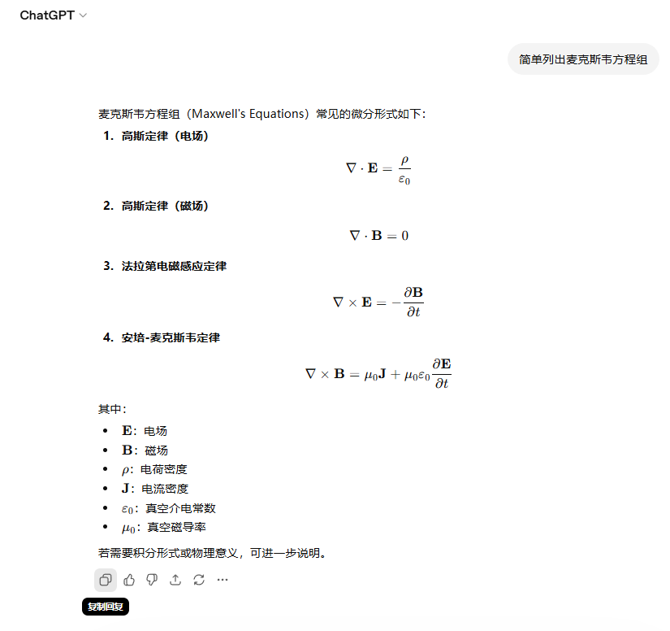
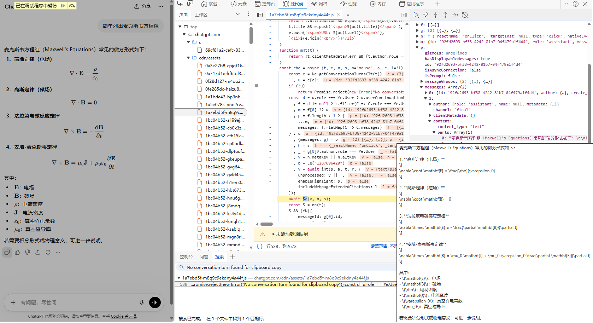

## 省流

装插件，我本来用的[ChatGPT & Gemini Markdown Copy](https://chromewebstore.google.com/detail/chatgpt-gemini-markdown-c/jhjeaknfkncejbnhdobkgcbfpebkbfcn)，但是最近失灵了。


这是我自己做到插件：[ChatGPT-Markdown-Copier@github.com](https://github.com/Huffer342-WSH/ChatGPT-Markdown-Copier.git)


## 历程

ChatGPT网页版会话下面的c复制出来的Markdown文本的公式界定符有问题，比如会把行内公式复制成：`* (\mathbf{E})：电场`，把行间公式复制成：
```markdown
   [
   \nabla \cdot \mathbf{E} = \frac{\rho}{\varepsilon_0}
   ]
```




很显然这个是latex的界定符，但是少了`\`, 正常是 `\[  \]`和 `\(\)`。

---

然后我就去看"复制回复"按钮是怎么工作的。在控制台输入以下代码添加断点，再点一次按钮可以找到
```js
(() => {
  const origWriteText = navigator.clipboard.writeText?.bind(navigator.clipboard);
  if (origWriteText) {
    navigator.clipboard.writeText = async function(text) {
      debugger;
      console.log("writeText:", text);
      return origWriteText(text);
    };
  }

  const origWrite = navigator.clipboard.write?.bind(navigator.clipboard);
  if (origWrite) {
    navigator.clipboard.write = async function(items) {
      debugger;
      console.log("write:", items);
      return origWrite(items);
    };
  }
})();
```




然后就会发现本来确实是标准的latex界定符版本的，但是后续给处理掉了。**很可惜，我不知道怎么难道这个完整的字符串**。看起来就是从局部变量里取出来的，js代码也混淆很不方便看。

---

所以最后只能从html转markdown了。幸好html的`katex`容器里有latex注释，比如：

```html
<span class="katex-display"><span class="katex"><span class="katex-mathml"><math xmlns="http://www.w3.org/1998/Math/MathML" display="block">
                <semantics>
                    ...
                    <annotation encoding="application/x-tex">\nabla \times \mathbf{B} = \mu_0 \mathbf{J} + \mu_0
                        \varepsilon_0 \frac{\partial \mathbf{E}}{\partial t}
                    </annotation>
                </semantics>
                ...
```
