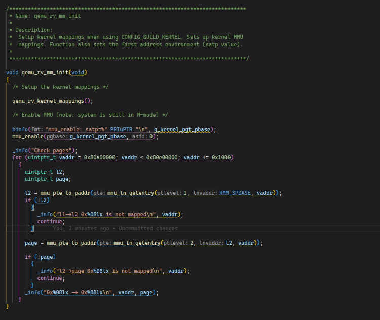
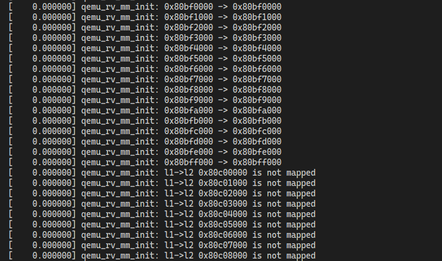

需求分页(On-Demand Paging)是指不在程序加载和申请内存是立马分配，而是在程序需要访问这些内容是才分配或是从存储加载内容

Nuttx文档：
[《OS Components -&gt; On-Demand Paging》](https://nuttx.apache.org/docs/latest/components/paging.html#)

该文的翻译见[《按需分页》](./On-Demand-Paging_zh-CN.md)

该功能的config为 `CONFIG_PAGING`


当前内核提供的配置中，开启‘On-Demand Paging’功能的只有一个risc-v的QEMU版本。

## risc-v32

nuttx内核中提供了一个可以在Qemu上运行的开启 `On demand paging`的配置：`rv-virt:knsh_paging`

配置位于：`nuttx/boards/risc-v/qemu-rv/rv-virt/configs/knsh_paging`

介绍:[《Supported Platforms / RISC-V / QEMU / Generic / rv-virt》](https://nuttx.apache.org/docs/latest/platforms/risc-v/qemu-rv/boards/rv-virt/index.html#knsh-paging)

**构建**

```sh
cd nuttx
./tools/configure.sh rv-virt:knsh_paging
make -j$(nproc) && make export -j$(nproc)
pushd ../apps
./tools/mkimport.sh -z -x ../nuttx/nuttx-export-*.tar.gz
make import -j$(nproc)
./tools/mkromfsimg.sh ../nuttx/arch/risc-v/src/board/romfs_boot.c
popd
make -j$(nproc)
```

**运行**

```sh
cd nuttx
qemu-system-riscv32 -M virt,aclint=on -cpu rv32 -nographic -kernel nuttx
```

### 注册中断

开启 `CONFIG_PAGING`（需求分页）后，

- up_irqinitialize()
  - riscv_exception_attach()
    ```c
    #ifdef CONFIG_PAGING
      irq_attach(RISCV_IRQ_LOADPF, riscv_fillpage, NULL);
      irq_attach(RISCV_IRQ_STOREPF, riscv_fillpage, NULL);
    #else
      irq_attach(RISCV_IRQ_LOADPF, riscv_exception, NULL);
      irq_attach(RISCV_IRQ_STOREPF, riscv_exception, NULL);
    #endif
    ```

### 加载elf

- elf_loadbinary()
  - modlib_initialize(), 读取elf头
  - modlib_load_with_addrenv()
    - modlib_loadhdrs(), 读取section header和program header
    - modlib_elfsize()
    - modlib_addrenv_alloc()
      - addrenv_allocate(), 新建一个addrenv
      - up_addrenv_create()
        - **create_region()**,开启 `CONFIG_PAGINF`后，该region只会分配一个page
    - modlib_addrenv_select()
    - modlib_loadfile()
    - modlib_addrenv_restore

### 访问内存

#### 中断入口部分

- exception_common() -> handle_irq() ，arch/risc-v/src/common/riscv_exception_common.S
  - riscv_dispatch_irq(irq, regs)，**进入C语言部分**; irq是中断序号，regs是sp,栈里保存了寄存器状态
    - riscv_doirq()

      1. irq_dispatch(),中断且套直接进入
      2. riscv_doirq_top()

      - 保存寄存器到TCB
      - irq_dispatch(irq, context)，**进入nuttx通用部分**
        - 从 `g_irqvector[]`查找中断服务函数入口和参数(vector、arg)，并跳转。（g_irqvector[]的13、15分别对应读、写错误）
        - **riscv_fillpage(irq, context, arg)**
          - 获取异常信息
            - `CSR_EPC`：触发异常
            - `CSR_TVAL`：需要访问的地址（虚拟地址）
          - 根据vaddr的大小判断访问的类型(text、data、heap)，并确定 `mmuflags`
          - 分配page并设置页表
      - 

#### `riscv_fillpage()`详解

此处以riscv32（SV32）为例，使用两级页表：


---

**`riscv_fillpage(int mcause, void *regs, void *args)`**

- 造成异常的原因: cause = mcause & RISCV_IRQ_MASK;
- 需要填充页的 `vaddr` = MM_PGALIGNDOWN(READ_CSR(CSR_TVAL));
- 根据 `vaddr`所属范围确定内存类型和 `mmuflags`; (text, data, heap)
- 获取根页表（一级页表）的虚拟地址

  ```c
  satp    = READ_CSR(CSR_SATP); // satp寄存器中包含页表物理地址

  /*  mmu_satp_to_paddr(satp)提取物理地址;
   *  riscv_pgvaddr()将物理地址转化为虚拟地址，一般内核空间的虚拟地址和物理地址只有简单的偏移，通过加减就可以转化
   */
  ptprev  = riscv_pgvaddr(mmu_satp_to_paddr(satp));
  ```
- 在一级页表中查找vaddr对应的paddr，paddr为0则代表一级页表没有配置

  ```c
  /* 从页表中查找vaddr对应的入口 */
  pte = mmu_ln_getentry(ptlevel, ptprev, vaddr)

  /* 从pte中提取出物理地址，此处是一级页表中查出来的页表入口(pte)，提取出来就是二级页表的地址 */
  paddr = mmu_pte_to_paddr(pte);
  ```
- paddr为0 -> 设置vaddr对应的一级页表入口

  + 分配一页物理页 `mm_pgalloc()`
  + 设置页表入口 `mmu_ln_setentry(ptlevel, ptprev, paddr, vaddr, MMU_UPGT_FLAGS);`
    因为这里是在一级页表中设置二级页表的地址，所以flag是 `MMU_UPGT_FLAGS`
- 设置二级页表

  + 获取二级页表的虚拟地址 `plast`
    ```c
    ptlast = riscv_pgvaddr(paddr);
    ```
  + 分配一页物理页 `mm_pgalloc()`
  + 设置页表入口 `mmu_ln_setentry(ptlevel + 1, ptlast, paddr, vaddr, mmuflags);`
    这里是最后一页，所以使用上文分类设置的mmuflags

---

### heap访问bug

app访问malloc分配出来的内存：

| p[] | MTVAL(app) | vaddr(app) | page_paddr | l2_vaddr(sys) | l2_paddr   | l1table    |
| --- | ---------- | ---------- | ---------- | ------------- | ---------- | ---------- |
| 461 | 0xc0bce008 | 0xc0bce000 | 0x80bff000 | 0x80a23000    | 0x80a23000 | 0x80a1e000 |
| 462 | 0xc0bcf008 | 0xc0bcf000 | 0x80c00000 | 0x80a23000    | 0x80a23000 | 0x80a1e000 |

app在访问 `0xc0bcf008`进入'Store/AMO page fault'后，成功分配一页page(0x80c00000)，但是在执行 `riscv_pgwipe(paddr);`时，出现了 `0x80c00000`也属于为分配区域的问题

```c
  ptlast = riscv_pgvaddr(paddr);
  paddr = mm_pgalloc(1); // 成功分配0x80c00000
  if (!paddr)
    {
      return -ENOMEM;
    }

  /* Wipe the physical page memory */

  riscv_pgwipe(paddr); // 初始化为0
```

该区域由系统管理，在系统启动时设置页表, 详情如下：

`arch/risc-v/src/qemu-rv/qemu_rv_mm_init.c` : `qemu_rv_kernel_mappings()`

| type | start      | end        | size(page) |
| ---- | ---------- | ---------- | ---------- |
| text | 0x80200000 | 0x80600000 | 1024       |
| data | 0x80600000 | 0x80a00000 | 1024       |
| pool | 0x80a00000 | 0x80e00000 | 1024       |

显然 `0x80c00000`也属于pgpool范围内。尝试在MMU启动后检查页表



运行结果如下



可以看到L1页表设置错误，经过分析发现问题处在 `qemu_rv_kernel_mappings()`函数中的 `map_region()`函数，函数定义如下：

```c
static void map_region(uintptr_t paddr, uintptr_t vaddr, size_t size,
                       uint32_t mmuflags)
{
  uintptr_t endaddr;
  uintptr_t pbase;
  int npages;
  int i;
  int j;

  /* How many pages */

  npages = (size + RV_MMU_PAGE_MASK) >> RV_MMU_PAGE_SHIFT;
  endaddr = vaddr + size;

  for (i = 0; i < npages; i += RV_MMU_PAGE_ENTRIES)
    {
      /* See if a mapping exists ? */

      pbase = mmu_pte_to_paddr(mmu_ln_getentry(
                 KMM_SPBASE_IDX, KMM_SPBASE, vaddr));
      if (!pbase)
        {
          /* No, allocate 1 page, this must not fail */

          pbase = slab_alloc();
          DEBUGASSERT(pbase);

          /* Map it to the new table */

          mmu_ln_setentry(
                  KMM_SPBASE_IDX, KMM_SPBASE, pbase, vaddr, MMU_UPGT_FLAGS);
        }

      /* Then add the mappings */

      for (j = 0; j < RV_MMU_PAGE_ENTRIES && vaddr < endaddr; j++)
        {
          mmu_ln_setentry(KMM_PBASE_IDX, pbase, paddr, vaddr, mmuflags);
          paddr += KMM_PAGE_SIZE;
          vaddr += KMM_PAGE_SIZE;
        }
    }
}
```

该函数负责将输入的 `vaddr`映射到 `paddr`。但是当 `vaddr`不对齐 $2^{22}$ 时，就会出现一级页表分配错误的问题。

而 `defconfig`中 `CONFIG_ARCH_PGPOOL_PBASE=0x80a00000`，并不对齐，导致后半页表都设置错误了。

## arm-v7a

新建app：

在 `up_addrenv_create()`打断点，启动一个应用看调用过程

创建addrenv
modlib_addrenv_alloc()

- up_addrenv_create()
  - arm_addrenv_create_region(text)
  - arm_addrenv_create_region(data)
  - arm_addrenv_create_region(heap) - 0x82000000~0x82100000 (256 * 4096)

销毁addrenv
addrenv_destroy()

- up_addrenv_destroy

MMU异常

```
arm_vectordata (arch/arm/src/armv7-a/arm_vectors.S)
-> arm_dataabort (arch/arm/src/arm/arm_dataabort.c)
```

| 宏定义                            | 值       | 描述                             |
| --------------------------------- | -------- | -------------------------------- |
| `FSR_FAULT_ALIGNMENT`           | `0x01` | 数据访问未对齐导致的异常         |
| `FSR_FAULT_DEBUG`               | `0x02` | 调试断点触发的异常               |
| `FSR_FAULT_TRANSLATION_L1`      | `0x05` | 一级页表翻译失败                 |
| `FSR_FAULT_TRANSLATION_L2`      | `0x07` | 二级页表翻译失败                 |
| `FSR_FAULT_ACCESS_FLAG_L1`      | `0x06` | 一级页表访问标志位错误           |
| `FSR_FAULT_ACCESS_FLAG_L2`      | `0x08` | 二级页表访问标志位错误           |
| `FSR_FAULT_DOMAIN_L1`           | `0x09` | 一级页表域（domain）错误         |
| `FSR_FAULT_DOMAIN_L2`           | `0x0b` | 二级页表域错误                   |
| `FSR_FAULT_PERMISSION_L1`       | `0x0d` | 一级页表权限错误（如只读页被写） |
| `FSR_FAULT_PERMISSION_L2`       | `0x0f` | 二级页表权限错误                 |
| `FSR_FAULT_SYNC_EXTERNAL_ABORT` | `0x08` | 同步外部中止                     |
| `FSR_FAULT_SYNC_EXTERNAL_L1`    | `0x0c` | 一级页表访问时的外部中止         |
| `FSR_FAULT_SYNC_EXTERNAL_L2`    | `0x0e` | 二级页表访问时的外部中止         |
| `FSR_FAULT_SYNC_PARITY_L1`      | `0x1c` | 一级页表访问时的奇偶校验错误     |
| `FSR_FAULT_SYNC_PARITY_L2`      | `0x1e` | 二级页表访问时的奇偶校验错误     |
| `FSR_FAULT_PARITY`              | `0x19` | 数据访问时的奇偶校验错误         |
| `FSR_FAULT_TLB_CONFLICT`        | `0x10` | TLB 冲突中止                     |
| `FSR_FAULT_ICACHE_MAINT`        | `0x04` | 指令缓存维护操作导致的异常       |
| `FSR_FAULT_LOCKDOWN`            | `0x14` | 实现定义的锁定中止（如安全扩展） |
| `FSR_FAULT_COPROC_ABORT`        | `0x1a` | 协处理器中止                     |
| `FSR_FAULT_PARITY_MEM_SYNC`     | `0x11` | 同步内存访问奇偶校验错误         |
| `FSR_FAULT_EXTERNAL_ASYNC`      | `0x16` | 异步外部中止                     |
| `FSR_FAULT_PARITY_MEM_ASYNC`    | `0x18` | 异步内存访问奇偶校验错误         |
