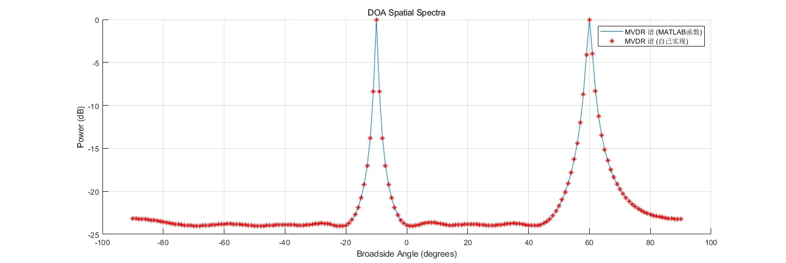

Capon算法，也称为最小方差无失真响应（Minimum Variance Distortionless Response, MVDR）波束形成器。Capon算法的主要目标是通过调整阵列天线的加权系数，使得在期望信号方向上保持无失真响应，同时最小化来自其他方向的干扰和噪声能量。

<!-- more -->
[[toc]]


## Capon算法原理

### 信号模型

在线性调频毫米波雷达的信号处理中，我们常常会先对接收到的信号根据距离维度或者速度维度分离，再测角。傅里叶变化并再频域分离后的信号，是非常标准的窄带信号（FFT本身可以视为窄带滤波器组）。因此在建立信号模型时，我们将信号假设为一个窄带信号。

信号带宽较窄的情况下，信号的频率成分集中，相邻频率分量的相位变化相对缓慢，从而在空间阵列上的时间延迟可以直接通过相位差来体现。再次基础上我们可以用相位差大大简化信号模型。

设现在存在 $M$ 个阵元 $p$ 个信号源，一帧数据供 $N$ 个快拍。

$$
\begin{equation}
    \boldsymbol{x}(n)=\boldsymbol{A} \boldsymbol{s}(n)+ \boldsymbol{n}(n)  
\end{equation}
$$

- $\boldsymbol{x}(n)$：   表示系统的输入信号， $\boldsymbol{x}(n)$ 是一个 $M\times 1$ 的列向量，分别表示 $M$ 个阵元接收到的信号。

- $\boldsymbol{s}(n)$：   并表示信号源发送过来的信号。一般选择其中1个阵元作为参考阵元，$\boldsymbol{s}(n)  = \begin{bmatrix}  s_{1}(n) \\ s_{2}(n) \\ \vdots \\ s_{p}(n) \end{bmatrix}$  ,  $s_{i}(n)$ 表示参考阵元接收到的第 $i$ 信号源的信号。

- $\boldsymbol{A}$:    是一个 $M\times p$ 的到达矢量矩阵，每一列都是一个到达矢量(arrival vector)，$\boldsymbol{A}=[\boldsymbol{a}(\omega_{1}),\boldsymbol{a}(\omega_{2}), \cdots ,\boldsymbol{a}(\omega_{p})]$，用于表示不同阵元接收到的信号的差异，通常 $x_{1}(n)$ 是参考阵元的接受信号， 此时 $A$ 的第一行为 $[1,1,\cdots,1]$ 。


 

- $\boldsymbol{n}(n)$:    表示噪声，是$M\times 1$ 的列向量。


### 设计权向量 $\boldsymbol{w}$

系统接收到的信号 $\boldsymbol{x}(n)$ 中叠加了多个信号源的信号。我们希望设计一个权向量 $\boldsymbol{w}$ 使得波束形成器的输出能够抽取出想要的信号源的方向，同时使得输出信号的总功率尽量的小。

我们先将这个系统简单描述成一下公式：

$$
\begin{equation}
   y(n) =  \boldsymbol{w}^{H}\boldsymbol{x}(n)
\end{equation}
$$

假设我们的目标时要从 $p$ 个信号源的信号 $\boldsymbol{s}(n)$ 中把我们想要的信号源 $k$ 的信号  $s_{k}(n)$ 分离出来。

首先将 $\boldsymbol{x}(n)$ 拆分：

$$
\begin{equation}
   \boldsymbol{x}(n) =  \boldsymbol{a}(\omega_{k}) s_{k}(n) +\displaystyle\sum_{i=1,i \neq k}^{p} \boldsymbol{a}(\omega_{i}) s_{i}(n) + \boldsymbol{n}(n) 
\end{equation}
$$

式子中的三项分别表示：期望得到的信号、其他干扰信号、噪声。将 $(3)$ 代入 $(2)$ 得：

$$
\begin{align}
    y(n) &=  
        \boldsymbol{w}^{H}[
        \boldsymbol{a}(\omega_{k}) s_{k}(n) +
        \displaystyle\sum_{i=1,i \neq k}^{p} \boldsymbol{a}(\omega_{i}) s_{i}(n) + 
        \boldsymbol{n}(n) 
        ]  \\
    y(n) &= 
        \boldsymbol{w}^{H} \boldsymbol{a}(\omega_{k})  s_{k}(n) +
        \displaystyle\sum_{i=1,i \neq k}^{p} \boldsymbol{w}^{H} \boldsymbol{a}(\omega_{i})  s_{i}(n) + 
        \boldsymbol{w}^{H} \boldsymbol{n}(n)
\end{align}
$$

假如我们希望保留期望信号 $s_{k}(n)$ 同时减少其他干扰信号 $s_{i}(n) ,i \neq k$ 的功率，则权向量需要满足一下公式：

$$ \begin{alignat}{2}
 \boldsymbol{w}^{H} \boldsymbol{a}(\omega_{k}) &= 1                               &\text{（波束形成条件）} \\
 \boldsymbol{w}^{H} \boldsymbol{a}(\omega_{i}) &= 0 ,  \omega_{i} \neq \omega_{k} &\text{（零点形成条件）}
\end{alignat} $$

由于信号源方向 $\omega_{i}$ 是未知的，仅仅依靠以上两个条件难以推导权向量 $\boldsymbol{w}$。因此我们使用另一个思路：在满足式 $(6): \boldsymbol{w}^{H} \boldsymbol{a}(\omega_{k}) = 1$ 的前提下，**令系统输出** $y(n)$ **的功率尽量的小**。 

$y(n)$ 的功率可以表示为：

$$
\begin{equation}
   E\{|y(n)|^{2}\} = \lim_{N \to \infty} \displaystyle\sum_{n=1}^{N} |y(n)|^{2} = \boldsymbol{w}^{H} \boldsymbol{R_{xx}}  \boldsymbol{w}
\end{equation}
$$
 
我们现在求解的问题是: 在约束条件 $(6)$ 的情况下，求得令 $E\{|y(n)|^{2}\}$ 最小的权向量 $\boldsymbol{w}$ ，用公式表达如下：
> 约束条件 $\boldsymbol{w}^{H} \boldsymbol{a}(\omega_{k}) = 1$ 代表无失真，期望令 $E\{|y(n)|^{2}\}$ 最小对应最小方差，合起来就是‘最小方差无失真’,所以常常将Capon算法称为‘最小方差无失真响应波束形成器(MVDR beamformer)’

$$ \begin{equation} \begin{aligned}
    & \min_{\boldsymbol{w}} \quad E\{|y(n)|^{2}\} = \boldsymbol{w}^{H} \boldsymbol{R_{xx}}  \boldsymbol{w} \\
    & \text{subject to} \quad \boldsymbol{w}^{H} \boldsymbol{a}(\omega_{k}) = 1
\end{aligned} \end{equation} $$

使用拉格朗日乘数法(Lagrange multiplier)求解这一优化问题。首先构造目标函数：

$$ \begin{equation}
    J(\boldsymbol{w}) = \boldsymbol{w}^{H} \boldsymbol{R_{xx}}  \boldsymbol{w} + \lambda [1 - \boldsymbol{w}^{H} \boldsymbol{a}(\omega_{k})]
\end{equation} $$

其中 $\lambda$ 为拉格朗日乘数。令 $J(\boldsymbol{w})$  的导数为0：

$$ \begin{align} 
    \frac{\partial J(\boldsymbol{w})}{\partial \boldsymbol{w}} = 0 \\
    \boldsymbol{R_{xx}} \boldsymbol{w} - \lambda \boldsymbol{a}(\omega_{k}) &= 0 
\end{align} $$

进一步计算如下：

$$ \begin{equation} \begin{aligned}
    \lambda \boldsymbol{a}(\omega_{k}) &=  \boldsymbol{R_{xx}} \boldsymbol{w} \\
    \lambda \boldsymbol{R_{xx}^{-1}}  \boldsymbol{a}(\omega_{k}) &=   \boldsymbol{w} \\
    \lambda \boldsymbol{a}(\omega_{k})^{H} \boldsymbol{R_{xx}^{-1}}  \boldsymbol{a}(\omega_{k}) &= \boldsymbol{a}(\omega_{k})^{H}  \boldsymbol{w} =1 \\
    \lambda &= \frac{1}{\boldsymbol{a}(\omega_{k})^{H} \boldsymbol{R_{xx}^{-1}}  \boldsymbol{a}(\omega_{k})} \\
\end{aligned} \end{equation} $$

将 $\lambda$ 重新代回去计算 $\boldsymbol{w}_{opt}$ ：
$$ \begin{equation} 
     \boldsymbol{w}_{opt} = \frac{\boldsymbol{R_{xx}^{-1}}  \boldsymbol{a}(\omega_{k})}{\boldsymbol{a}(\omega_{k})^{H} \boldsymbol{R_{xx}^{-1}}  \boldsymbol{a}(\omega_{k})}
\end{equation} $$

将 $\boldsymbol{w}_{opt}$ 带入式 $(8)$ 可以得到 Capon空间谱:

$$
\begin{equation}
    P_{Capon}(\omega) = \frac{1}{\boldsymbol{a}(\omega)^{H} \boldsymbol{R_{xx}^{-1}}  \boldsymbol{a}(\omega)}
\end{equation}
$$

遍历所有 $\omega$ 值， 得到 Capon空间谱并找到 $p$ 个峰值，每一个峰值对应的$\omega$ 值即为波束方向。

## matlab程序仿真

matlab提供了两个Cpaon算法的函数[phased.MVDREstimator](https://ww2.mathworks.cn/help/phased/ref/phased.mvdrestimator-system-object.html) 和 [phased.MVDREstimator2D](https://ww2.mathworks.cn/help/phased/ref/phased.mvdrestimator2d-system-object.html)，分别是一维和二维的测角。


这边在matlab例子的基础上自己实现一遍Capon算法，对比一下结果是否一致

matlab的例子可以用下面的指令打开

```matlab
openExample('phased/EstimateDOATwoSignalsUsingMVDRExample')
```

### 完整代码

```matlab
clear; clc; close all
%% 初始化参数，生成阵列信号

fs = 8000;
t = (0:1 / fs:1).';
x1 = cos(2 * pi * t * 300);
x2 = cos(2 * pi * t * 400);
% 生成均匀线阵
array = phased.ULA('NumElements', 10, 'ElementSpacing', 1);
array.Element.FrequencyRange = [100e6 300e6];
fc = 150.0e6;
x = collectPlaneWave(array, [x1 x2], [-10 0; 60 0]', fc);
noise = 0.1 * (randn(size(x)) + 1i * randn(size(x)));
signal = x + noise;
axis_angle = (-90:1:90);

%% Capon谱 phased.MVDREstimator
estimator = phased.MVDREstimator('SensorArray', array, 'ScanAngles', axis_angle, ...
    'OperatingFrequency', fc, 'DOAOutputPort', true, 'NumSignals', 2);
[y, doas] = estimator(signal);
doas = broadside2az(sort(doas), [20 -5])

%% Capon谱

addpath '.\function'
% 获取阵元坐标
ula_pos = getElementPosition(array);
% 计算到达矢量
steering_vectors = steering_vector(ula_pos, [axis_angle; zeros(size(axis_angle))], physconst('LightSpeed') / fc);
% 去直流 转置
x = transpose(signal - mean(signal, 1));
% 自协方差矩阵
Cxx = x * x';
my_mvdr_spec = 1 ./ sum(steering_vectors' / Cxx .* steering_vectors.', 2);
my_mvdr_spec = abs(my_mvdr_spec);
my_mvdr_spec = sqrt(my_mvdr_spec);

figure("Name", "Capon 算法测角")

hold on;
helperPlotSpec(axis_angle, y, 'MVDR 谱 (MATLAB函数)');
helperPlotSpec(axis_angle, my_mvdr_spec, 'MVDR 谱 (自己实现)', 'r*');
hold off;
```

### 详解

第一步是计算遍历角度是用到的导向矢量,```sv = steering_vector(pos, ang, lambda)``` 函数输入阵元位置、角度、信号波长，输出导向矢量,详细解释可以看 [到达矢量 (Arrival vector)](./arrival-vector.md)，源文件见[steering_vector.m](https://github.com/Huffer342-WSH/myNotes/blob/main/radar/project/function/steering_vector.m)
```matlab
% 获取阵元坐标
ula_pos = getElementPosition(array);
% 计算到达矢量
steering_vectors = steering_vector(ula_pos, [axis_angle; zeros(size(axis_angle))], physconst('LightSpeed') / fc);
```

然后计算协方差矩阵，matlab的例程得到的信号```x```是一个行向量矩阵，所以先转置，在计算协方差矩阵

```matlab
% 去直流 转置
x = transpose(signal - mean(signal, 1));
% 自协方差矩阵
Cxx = x * x';
```

得到协方差矩阵和导向矢量后，就可以按照  $P_{Capon}(\omega) = \frac{1}{\boldsymbol{a}(\omega)^{H} \boldsymbol{R_{xx}^{-1}}  \boldsymbol{a}(\omega)}$ 计算空间谱了。

这里的```steering_vectors```中包含了多个导向矢量，可以用循环一个一个计算，也可以按照下面的方法算。最后还开根号了，这一步在实际应用中是没有必要的，只是为了和matlab的phased.MVDREstimator得到的结果一致。

```matlab
my_mvdr_spec = 1 ./ sum(steering_vectors' / Cxx .* steering_vectors.', 2);
my_mvdr_spec = abs(my_mvdr_spec);
my_mvdr_spec = sqrt(my_mvdr_spec);
```

### 结果
```
doas =

  -10.6490   60.3813
```


