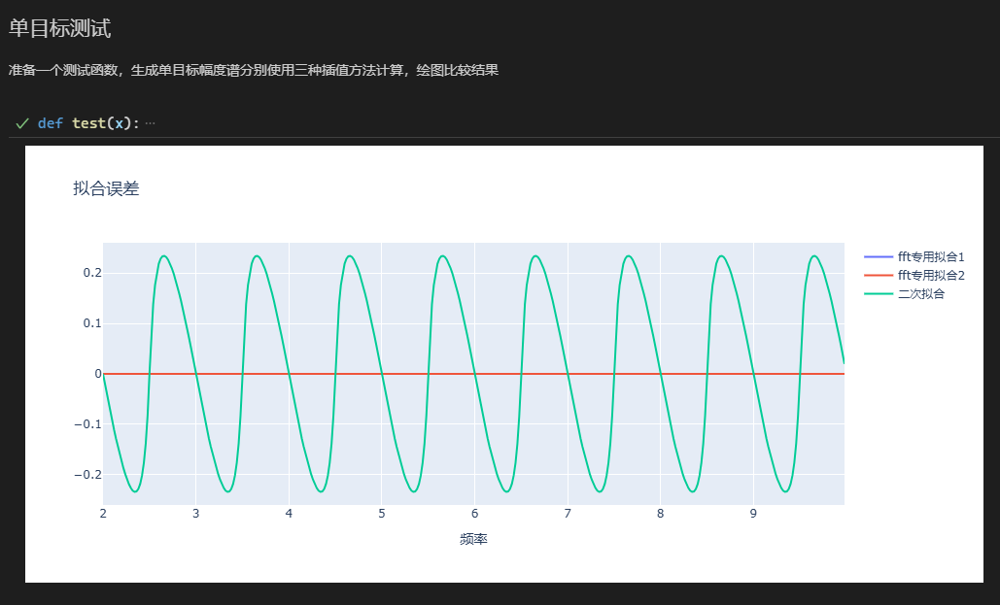
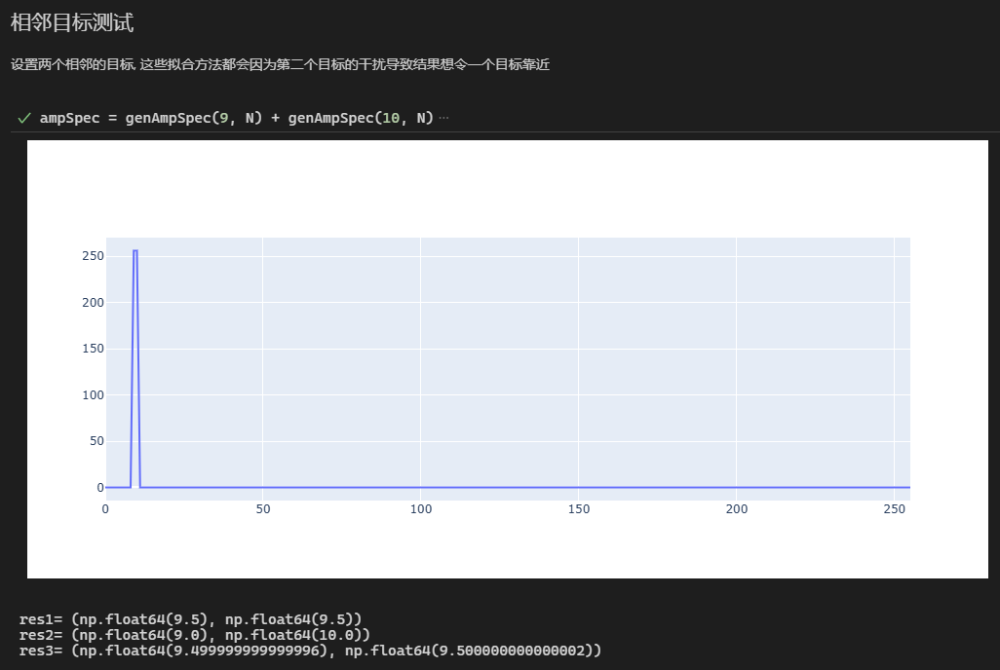

## 1. 问题描述

当信号为单一频率成分，但其频率不在FFT分辨率点上时，无法直接通过FFT幅度谱峰值点获得精确频率。

在单一信号频率无噪声的情况下，幅度谱的‘形状’只和频率有关，和信号的幅度与相位无关（这里的形状可以指归一化幅度谱）。因此可以尝试通过幅度谱的形状推导出频率。

本文通过数学推导得出幅度谱比值和频率的关系，从而得到频率插值的公式。

```python
def fit_func1(x0, x1, x2, y0, y1, y2):
    assert y1 >= y0 and y1 >= y2
    a = x1
    b = -1 if (y0 > y2) else 1
    r = y1 / (y0 if (y0 > y2) else y2)
    x_peak = a + b / (r + 1)
    return x_peak
```

具体的Python实验：[非整数倍周期信号FFT影响.py](https://github.com/Huffer342-WSH/lfmcw_radar_dsp/blob/develop/experiment/%E9%9D%9E%E6%95%B4%E6%95%B0%E5%80%8D%E5%91%A8%E6%9C%9F%E4%BF%A1%E5%8F%B7FFT%E5%BD%B1%E5%93%8D.py)

该方法的实际应用：[idx_estimation()函数：通过中心点的幅度谱值与相邻点的幅度谱值，估计出更精确的坐标](https://github.com/Huffer342-WSH/LFMCW-Radar-DSP_C-Language/blob/develop/Core/Source/signal_processing/fixed_point/radar_dis_velo.c)

## 2. 数学模型

### 2.1 信号定义

考虑归一化频率为 $f$ 的复指数信号：

$$
x[n] = e^{j2\pi f n}, \quad n=0,1,\cdots,N-1
$$

其DFT定义为：

$$
X[k] = \sum_{n=0}^{N-1} x[n] e^{-j2\pi kn/N}
$$

### 2.2 等比数列求和

将信号表达式代入DFT：

$$
X[k] = \sum_{n=0}^{N-1} e^{j2\pi f n} \cdot e^{-j2\pi kn/N} = \sum_{n=0}^{N-1} e^{j2\pi n (f - k/N)}
$$

这是一个首项为 $a_1 = 1$，公比为 $r = e^{j2\pi (f - k/N)}$ 的等比数列。等比数列求和公式为：

$$
S_N = a_1 \frac{1 - r^N}{1 - r}
$$

代入参数：

$$
X[k] = \frac{1 - [e^{j2\pi (f - k/N)}]^N}{1 - e^{j2\pi (f - k/N)}}
$$

### 2.3 简化表达式

化简分子：

$$
[e^{j2\pi (f - k/N)}]^N = e^{j2\pi N(f - k/N)} = e^{j2\pi (Nf - k)}
$$

由于 $k$ 是整数，$e^{-j2\pi k} = 1$，所以：

$$
e^{j2\pi (Nf - k)} = e^{j2\pi Nf}
$$

因此分子简化为：

$$
1 - e^{j2\pi Nf}
$$

最终DFT表达式为：

$$
X[k] = \frac{1 - e^{j2\pi Nf}}{1 - e^{j2\pi (f - k/N)}}
$$

### 2.4 幅度谱表达式

幅度谱为：

$$
|X[k]| = \left| \frac{1 - e^{j2\pi Nf}}{1 - e^{j2\pi (f - k/N)}} \right|
$$

利用复指数性质 $|1 - e^{j\theta}| = 2|\sin(\theta/2)|$：

$$
|X[k]| = \frac{|\sin(\pi Nf)|}{|\sin[\pi (f - k/N)]|}
$$


## 3. 任意两点幅度比值计算

### 3.1 分类讨论

$|X[k]|$表达式的分子是一个不随序号$k$改变的值，那么通过相除可以去掉该项

考虑频点 $a$ 和 $b$，其幅度比为：

$$
\frac{|X[a]|}{|X[b]|} = \frac{|\sin[\pi (f - a/N)]|^{-1}}{|\sin[\pi (f - b/N)]|^{-1}} = \frac{|\sin[\pi (f - b/N)]|}{|\sin[\pi (f - a/N)]|}
$$


当 $f-b/N$ 的值非常小时，可以应用近似：

$$
sin(x) = x
$$

因此我们取点峰值点$k_1$与相邻点$k_1 \pm 1$计算比值

在峰值邻域（$k_1$及其相邻点），设$f = \frac{k_1 + \delta}{N}$，则：

1. 峰值点$k_1$：
$$
   |X[k_1]| \propto \frac{1}{|\sin(\pi \delta/N)|}
$$

2. 相邻点$k_1 \pm 1$：
$$
   |X[k_1 \pm 1]| \propto \frac{1}{|\sin[\pi (\delta \mp 1)/N]|}
$$

---
**情况1：$\delta \geq 0$(取右侧点$k_1+1$)**

$$
r = \frac{|X[k_1]|}{|X[k_1+1]|} = \frac{|\sin[\pi (\delta - 1)/N]|}{|\sin(\pi \delta/N)|}
$$

当$N$较大时，小角度近似$\sin\theta \approx \theta$：
$$
r \approx \frac{|\pi (\delta - 1)/N|}{|\pi \delta/N|} = \frac{|1 - \delta|}{\delta} = \frac{1 - \delta}{\delta}
$$

解得：
$$
\delta \approx \frac{1}{r + 1}
$$

---
**情况2：$\delta < 0$(取左侧点$k_1-1$)**
$$
r = \frac{|X[k_1]|}{|X[k_1-1]|} = \frac{|\sin[\pi (\delta + 1)/N]|}{|\sin(\pi \delta/N)|} \approx \frac{|1 + \delta|}{|\delta|} = -\frac{1 + \delta}{\delta}
$$


解得：
$$
\delta \approx \frac{-1}{r + 1}
$$
---

### 3.2 统一表达式

两种情况的解可统一表示为：
$$
\delta \approx \frac{b}{r + 1}
$$
其中：
$$
b = \begin{cases}
1 & \delta \geq 0 \\
-1 & \delta < 0
\end{cases}
$$

### 综上

我们计算拟合频点的方法为
1. 找到幅度谱$|X|$ 的峰值点 $k_1$ 以及相邻点中较大的点 $k_1 \pm 1$
2. 计算 $r = \frac{|X[k_1]|}{|X[k_1 \pm 1]|}$， b = $1$ or $-1$
3. 根据 $r$ DFT频点 $fN$
    $$
    fN = k_1 + \delta = k_1 + \frac{b}{r + 1} ,

    b = \begin{cases}
    1 & \delta \geq 0 \\
    -1 & \delta < 0
    \end{cases}
    $$


## 4. 其他

假如选择峰值点和较小的相邻点推导，公式为

$$
fN =  k_1 + \frac{b}{1-r} ,

b = \begin{cases}
1 & \delta \geq 0 \\
-1 & \delta < 0
\end{cases}
$$

## 5. 实验

此处展示[非整数倍周期信号FFT影响.py](https://github.com/Huffer342-WSH/lfmcw_radar_dsp/blob/develop/experiment/%E9%9D%9E%E6%95%B4%E6%95%B0%E5%80%8D%E5%91%A8%E6%9C%9F%E4%BF%A1%E5%8F%B7FFT%E5%BD%B1%E5%93%8D.py)的运行结果

1. 测试不同频率的正弦信号下通过幅度谱峰值计算频率的误差



2. 生成一个包含两种频率成分的信号，搜索幅度谱峰值后进行插值求频率


