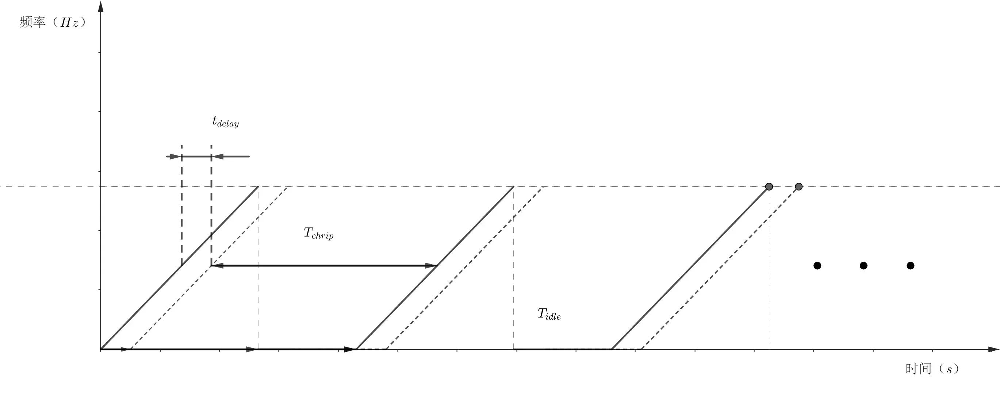

调频连续波(Frequency Modulated Continuous Wave)雷达在交通领域、室内定位等一些民用领域应用较多。线性调频连续波（LFMCW，Linear Frequency Modulated Continuous Wave）毫米波雷达是最基础的一种毫米波雷达，一般学习都从这个入手，实际场景中使用的毫米波雷达调制方式和波束都更为复杂。

## 信号模型

LFMCW雷达系统发射一个连续的波形信号，其频率随时间线性变化，形成一个锯齿波或者三角波频率调制信号。一般一个调频周期简称为一个chrip或者一个脉冲。

雷达会将接收到的反射信号与当前发射信号进行混频，产生一个差频信号（拍频信号）。差频信号的频率与目标物体的距离成正比；同一个通道，不同chrip之间的微小相位差可以反应速度信息；不同通道直接的信号差距反应目标的方向信息。

- 距离测量：通过测量差频信号的频率，可以计算出目标物体的距离。
- 速度测量：通过多次测量的相位变化，利用多普勒效应可以计算目标物体的速度。
- 角度测量：通过天线阵列和波束成形技术，可以确定目标物体的方位角。

我们处理信号的起点是混频后的信号采样后的离散数据,一般将数据排列成一个 $M×N×L$ 的三维数组
- $M$ 表示空间维的长度，表示共有 $M$ 个通道
- $N$ 表示速度（慢时间）维的长度，表示共有 $N$ 个chrip
- $L$ 表示距离（慢时间）维的长度，表示一个chrip共 $L$ 个采样点

这个三维数组被称为[radar-data-cube](https://ww2.mathworks.cn/help/phased/gs/radar-data-cube.html)。使用这个三维数组来保存数据视为了更好的区分三个维度，信号处理就是在此基础上进行的。

一般雷达会在混频时采取IQ混频，得到两路正交的数据分别作为实部和虚部组成一个复数。IQ采样的好处是可以从一个点看出信号的相位，在测角时用处很大。

具体的原理和仿真代码见 [1_LFMCW-radar-receiving-signal-simulation.md](./project/doc/1_LFMCW-radar-receiving-signal-simulation.md)

## 测距测速

2-D FFT 可以分离不同速度和距离的信号。一些常见的参数计算如下
在线性调频连续波 (LFMCW) 雷达系统中，速度分辨率、距离分辨率、最大测速范围和最大测距范围的计算公式如下：

### 1. **速度分辨率 (Velocity Resolution)**

速度分辨率是指雷达能够区分的最小速度差，公式为：

$$
v_{res} = \frac{\lambda}{2T_{\text{coh}}}
$$

其中：
- $v_{res}$ 是速度分辨率
- $\lambda$ 是雷达信号的波长
- $T_{\text{coh}}$ 是雷达的相干处理时间，通常是连续的多个Chrip组成的一帧数据

> 测速分辨率很直观，就是观察的时间越长，分辨率越高，非常的符合直觉。实际应用中内存足够的话只要选择够长的时间就可以满足。内存不足时可以选择降采样。

### 2. **距离分辨率 (Range Resolution)**

距离分辨率定义为雷达能够区分的最小目标距离差，公式为：

$$
R_{res} = \frac{c}{2B}
$$

其中：
- $R_{res}$ 是距离分辨率
- $c$ 是光速 $3 \times 10^8 \, \text{m/s}$
- $B$ 是有效的调频带宽，单位为赫兹 (Hz)。

>有效的调频带宽是指单个脉冲中，采样点覆盖区域的调频带宽，相比雷达扫频范围略小。值得注意的一点是基于匹配滤波的脉冲压缩雷达系统中，距离分辨率也是这个。从另一方面来讲傅里叶变换相当于对每一个距离们的信号分别做匹配滤波。 距离分辨率受限于调频带宽，而调频带宽基本是硬件受限于法律法规，往往不是我们在数字信号处理时需要考虑的。

### 3. **最大测速范围 (Maximum Velocity Range)**

最大测速范围取决于系统的脉冲重复频率 (PRF)，公式为：

$$
v_{\text{max}} = \frac{\lambda}{4T_p}
$$

其中：
- $v_{\text{max}}$ 是最大测速范围
- $\lambda$ 是波长
- $T_p$ 是脉冲重复周期。

> 控制最大测速范围主要控制Chrip的间隔。也就是说在做数字信号处理时，需要足够块的处理速度以满足最大测速范围。

### 4. **最大测距范围 (Maximum Range)**

在LFMCW雷达中，最大测距范围由雷达的带宽、采样点数以及采样率共同决定。修正后的最大测距范围公式为：

$$
R_{\text{max}} = \frac{c \cdot N}{2B}
$$

其中：
- $R_{\text{max}}$ 是最大测距范围
- $c$ 是光速 $3 \times 10^8 \, \text{m/s}$
- $N$ 是采样点数
- $B$ 是调频带宽

> 傅里叶变化中决定的测距的理论上线往往超过我们需求的测距范围，很多时候限制测距范围的是射频设备的性能。

...未完待续

## DOA估计

**波达方向估计（Direction of Arrival Estimation, DOA）**是指根据接收到的信号，在不同天线之间的相位差或振幅差等信息，估计信号来自空间中哪个方向。常见的DOA算法包括**Beamscan（波束扫描）**、**Minimum-Variance Distortionless Response (MVDR)（最小方差无失真响应）**、**MUSIC（Multiple Signal Classification，多信号分类）**、**2-D MUSIC** 和 **Root-MUSIC**。

1. **Beamscan（波束扫描）**： Beamscan算法是一种直接的DOA估计方法，它通过在不同方向上形成波束并测量每个波束的能量来确定信号来源的方向。具体来说，该算法通过在空间中的不同方向上设置波束来搜索最大响应，然后将最大响应对应的方向作为信号的到达方向。这种方法简单直观，但受限于波束的选择和分辨率。
2. **Minimum-Variance Distortionless Response (MVDR)（最小方差无失真响应）**： MVDR算法旨在最小化输出信号的方差，同时保持对预期信号方向的无失真响应。它通过计算协方差矩阵的逆来实现。MVDR算法通常在受到噪声干扰时表现出色，能够有效地抑制噪声，提高DOA估计的准确性。
3. **MUSIC（Multiple Signal Classification，多信号分类）**： MUSIC算法是一种基于子空间分解的频谱方法，通过对信号子空间进行分析，能够准确地估计出多个信号的到达方向。MUSIC算法首先通过计算传感器阵列接收到的信号的特征向量分解协方差矩阵，然后通过对特征向量的空间谱进行峰值检测来确定信号的到达方向。
4. **2-D MUSIC**： 2-D MUSIC是MUSIC算法的扩展，用于处理二维平面阵列的信号处理问题。与传统的MUSIC算法相比，2-D MUSIC可以更精确地估计出信号在二维空间中的到达方向，适用于具有更复杂几何结构的阵列。
5. **Root-MUSIC**： Root-MUSIC算法是MUSIC算法的一种变体，它通过对特征值分解的根求解方法来直接估计信号到达方向，避免了对空间谱的搜索过程。Root-MUSIC算法通常具有更高的分辨率和更快的计算速度，适用于需要实时性能的应用场景。

matlab的[Phased Array System Toolbox](https://ww2.mathworks.cn/help/phased/index.html)用于模拟传感器阵列和波束形成系统。不过里面的很多功能封装了很多层，想要直接抄代码还是有点难度。一般来说学习的时候可以自己实现一个功能然后用matlab提供的功能来验证结果。

matlab提供的函数列表可以看这个网页 [Beamforming and Direction of Arrival Estimation — Functions](https://ww2.mathworks.cn/help/phased/referencelist.html?type=function&listtype=cat&category=beamforming-and-direction-finding&blocktype=all&capability=&startrelease=&endrelease=&s_tid=CRUX_topnav)
### 关于到达矢量

想要从不同通道的接收信号中估计信号的方向，就要先知道不同位置的阵元接收到的信号到底有什么差别，而到大矢量就是用来近似的描述这个区别的。

[到达矢量 (Arrival vector)](./arrival-vector.md)

### Capon 算法

[Capon算法（MVDR 波束形成器）](./Capon-algorithm.md)

### MUSIC 算法

[MUSIC算法](./MUSIC-algorithm.md)

### ...未完待续
