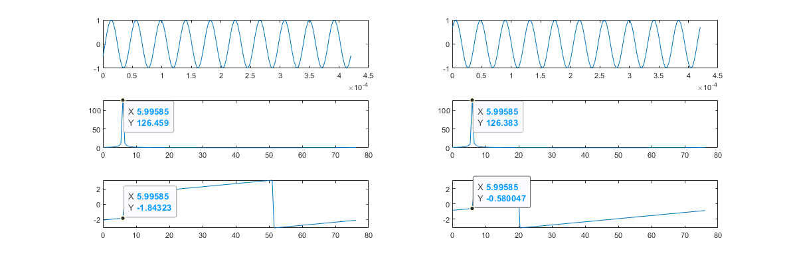
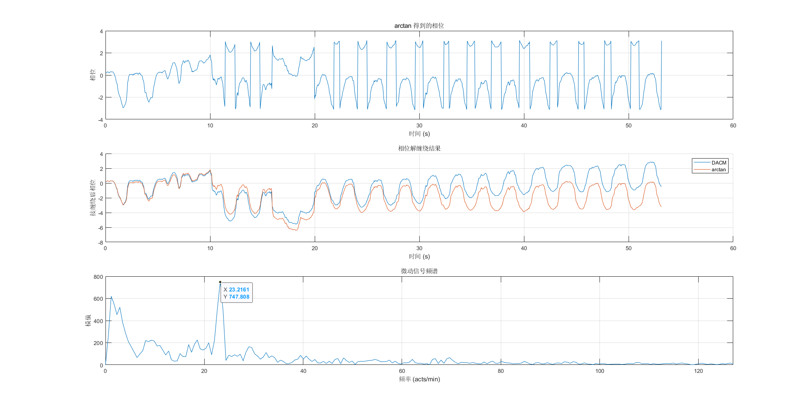

我先找到了这篇2023年的论文[[1]《Noncontact Cardiac Activity Detection Based on Single-Channel ISM Band FMCW Radar》](https://doi.org/10.3390/bios13110982)，暂不论期刊的档次，这篇论文的实验场景比较符合我的需求。它使用的是英飞凌(infineon)的[BGT24MTR12](https://www.infineon.com/cms/en/product/sensor/radar-sensors/radar-sensors-for-iot/24ghz-radar/bgt24mtr12/)雷达芯片，24GHz载频 150MHz带宽。同一个作者2021年发的[《High Accuracy Motion Detection Algorithm via ISM Band FMCW Radar》](https://doi.org/10.3390/rs14010058)，这篇论文内容是他2023年那篇的前置，对相位处理这部分将的更详细，他提出**由于频谱泄漏使得傅里叶变换的相位不再与信号的真实相位一致。研究了傅里叶变换实部和虚部的变化规律，给出了椭圆近似的修正相位的方法**，这个功能属于锦上添花没暂时不做考虑。

后来又找到了一篇综述[《Radar-Based Monitoring of Vital Signs: A Tutorial Overview》](https://doi.org/10.1109/JPROC.2023.3244362)，这篇论文档次就比较高了，内容也比较完整，学习毫米波雷达生命感知就以这篇为主，再看看它里面的引文。


开放获取的文章我还在网站上拷贝了一份
-  [Qu, K.; Wei, L.; Zhang, R. Noncontact Cardiac Activity Detection Based on Single-Channel ISM Band FMCW Radar. Biosensors 2023, 13, 982. https://doi.org/10.3390/bios13110982](https://cdn.jsdelivr.net/gh/Huffer342-WSH/myNotes/radar/paper/%E5%9F%BA%E4%BA%8E%E5%8D%95%E9%80%9A%E9%81%93%20ISM%20%E9%A2%91%E6%AE%B5%20FMCW%20%E9%9B%B7%E8%BE%BE%E7%9A%84%E9%9D%9E%E6%8E%A5%E8%A7%A6%E5%BC%8F%E5%BF%83%E8%84%8F%E6%B4%BB%E5%8A%A8%E6%A3%80%E6%B5%8B.pdf)
-  


## 概述

综述[[1]](#refer-1)中给出了提取生命体征学习的流程图


提取相位信息后
- 带通滤波并FFT后提取心跳信息
- 呼吸由于能量比较大，不需要带通滤波这一步。
  
提取相位的主要流程如下
1. 静态杂波滤波，滤除测试目标周围的非周期性运动目标
2. Range-FFT，检测测试目标的位置，并将生命信号提取限制在该位置的范围内,初步得到相位信息
3. 相位解缠绕


##  相位差与距离的关系


毫米波雷达的接收信号的相位对目标的位置变化很敏感。因为电磁波传播是一个来回，距离差是物体距离差的两倍，所以两个物体距离差半个波长，相位就会变化2π。当然这是对定频雷达而言的，假如发射信号是调频的，不同时间的两个物体回波的相位差就不是固定的了。

这里简单计算一下 ，看一下调频对相位差的影响有多少。

假如我们以调频信号的中心频率为参考，得到的两个不同位置目标的相位差应该是

$$
\begin{equation}
\Phi_{\Delta}(t) = 2 \pi (f_{c}+\frac{B}{2})\frac{2d_{\Delta}}{c}
\end{equation}
$$

对于线性调频雷达而言，发射信号的相位 $\Phi_{t}(t)$ 、 接收信号的相位 $\Phi_{r}(t)$ 、混频后中频信号的相位 $\Phi_{mix}(t)$ 的表达式如下：


$$
\begin{align}
    \Phi_{t}(t) &= 2\pi(f_{c} t + \frac{B}{2 T_{chrip}}t^{2}) \\
    \Phi_{r}(t) &= 2\pi(\Phi_{t}(t-\tau) = f_{c} (t-\tau) + \frac{B}{2 T_{chrip}}(t-\tau)^{2}) \\
    \Phi_{mix}(t) &= \Phi_{t}(t) - \Phi_{r}(t)  = 2\pi(f_{c} \tau  + \frac{B}{2 T_{chrip}}(2t\tau-\tau^{2})) \\
\end{align}                                            
$$

其中 $\tau$ 是目标回波的延迟 $\tau=\frac{2d}{c}$，$B$ 是调频的带宽 $T_{chrip}$ 是Chrip的时长。 $t$ 的取值范围是 $[0,T_{chrip}]$

那么两个不同位置的目标对应的中频信号的相位差 $\Phi_{\Delta}(t)$ 表达式如下：

$$
\begin{equation}
    \Phi_{\Delta}(t) =2 \pi \{ f_{c} (\tau_{1}-\tau_{2}) + \frac{B}{2 T_{chrip}}[\tau_{1}^{2}-\tau_{2}^{2}+2(\tau_{2}-\tau_{1})t] \} 
\end{equation}
$$

### matlab测试代码

```matlab
clear; clc; close all
%% 参数
bandWidth = 250e6; %带宽
fc = 24e9; % 载波频率
T_chrip = 420e-6; %  chirp 持续时间
T_idle = 580e-6; % 两个chirp之间的间隔时间
c = physconst('LightSpeed'); %光速
lambda = c/fc;
%% 频域相位差
dis = [6;6+0.1*lambda];
tau = dis*2/c;
axis_t = linspace(0,T_chrip,128);
axis_range = (0:127)*c/(2*bandWidth);
phi = 2*pi *(fc .* tau + (bandWidth/2/T_chrip)*(2*tau*axis_t-tau.^2));
signal = exp(1j*phi);
freq_domain = fft(signal,size(signal,2),2);
figure;
subplot(321);plot(axis_t,real(signal(1,:)));
subplot(323);plot(axis_range,abs(freq_domain(1,:)));
subplot(325);plot(axis_range,angle(freq_domain(1,:)));
subplot(322);plot(axis_t,real(signal(2,:)));
subplot(324);plot(axis_range,abs(freq_domain(2,:)));
subplot(326);plot(axis_range,angle(freq_domain(2,:)));
%% 时域相位差
phi_diff =phi(1,:)-phi(2,:);
ref_diff = ones(size(axis_t))*2*pi*(fc+bandWidth/2)*(tau(1)-tau(2));
max_error = max(abs(phi_diff-ref_diff))/2/pi*100;
fprintf('误差：%d %\n',max_error);

figure;
subplot(311);plot(phi(1,:));title("目标1 中频相位");
subplot(312);plot(phi(2,:));title("目标2 中频相位");
subplot(313);plot(phi_diff,'DisplayName', "调频信号相位差");hold on;plot(ref_diff,'DisplayName', "参考值");hold off;title("相位差");
```

### matlab测试结果

```
误差：0.2604291%
```



可以看到

### 小节

对于LFMCW雷达来说，两个不同位置的目标的回波的相位差也可以用 $\Phi_{\Delta}(t) = 2 \pi (f_{c}+\frac{B}{2})\frac{2d_{\Delta}}{c}$ 近似的代替。一般情况下直接取频域中峰值点的相位即可。

## 提取相位

### 初步得到相位


> 

对于FMCW雷达来说，一般再Range-FFT后的频域获取相位信息。时域采集到的数据用 $x$ 表示, $x$ 是一个 $N_{0} \times N_{c}$ 的数组，$N_{0}$ 是每个chrip的采样点数，$N_{c}$ chrip总数。
时域数据沿着快时间维度FFT（Range-FFT）的得到复数矩阵 $\boldsymbol{\mathrm{X}}$ :

$$
\begin{equation}
 X\left [{l,n}\right ]\triangleq \frac {1}{N}\sum _{k=0}^{N-1}x\left [{k,n}\right ]\exp \left ({ -j2\pi nl/N_{0}^{\prime }}\right )\! 
\end{equation}
$$

$\tilde {l}$ 表示目标所在的距离单元。$X\left [{\tilde {l},n}\right ]$ 表示Range-FFT频域中第 $\tilde {l}$ 个距离单元的第 $n$ 个点。通过频域点的复数的相位可以得到目标回波的相位

$$
\begin{equation}
 \hat {\psi }[ n ]=\angle \left (X\left [{\tilde {l},n}\right ]\right )\! 
\end{equation}
$$

***
**编程实现：** 

C 标准库 `<math.h>` 中提供了`atan2()`函数 ，使用`atan2()`函数返回从 x 轴到点 (x, y) 的角度，以弧度为单位。这个函数比单独使用 atan() 函数更强大，因为它考虑了 x 和 y 的符号，从而可以确定正确的象限。在ARM架构的单片机上开发时，还可以使用[CMSIS-DSP](https://github.com/ARM-software/CMSIS-DSP/tree/main)的 `arm_atan2_f32`函数。
***

  
### 相位解缠绕(Phase Unwrapping)

>

由于初步解出来的相位是周期性的，所以需要解缠绕。举一个例子，假设上一步解得相位值域为 $[- \pi ,pi)$ ,前后得到两个相位 $0.9\pi$ 和 $-0.9 \pi$ ，那么实际上的相位可能是增加了 $0.2\pi$ 也可能是 $0.2+2k\pi,k \in Z,k \neq 0$ ，这个时候我们就要选取一个正确的值。

为了避免 $2\pi$ 模糊的问题，我们一般通过选取合适的采样频率 $f_{s}$，使得我们的目标信号再两个采样点的相位变化小于 $\pi$, 这样我们就可以得到唯一确定的相位差分值，从而实现相位解缠绕。

$$
\begin{align}
\begin{cases}
\Delta \phi < \pi\\
\Delta \phi =\frac{4\pi}{\lambda}\Delta d\\
\end{cases} \\
  \frac{4\pi}{\lambda}\Delta d = \frac{4\pi}{\lambda}v \Delta t < \frac{4\pi}{\lambda}v \Delta \frac{1}{f_{s}} <  \pi \\
  f_{s} > \frac{4v}{\lambda}
\end{align}
$$


### 普通的解缠绕方法

相位解缠绕的基本步骤就是先判断相邻的两个采样点的相位差，再累加，判断相位差的标准是 $|\Delta \phi |< \pi$，如果大于$\pi$，则需要加减 $2\pi$。调整相位差。

### DACM算法解缠绕

>However, the use of unwrapping may introduce errors in the presence of abrupt phase variations. In this case, the extended differentiate and cross-multiply (DACM) algorithm proposed in [71] or its modified version [72] should be employed to achieve precise phase unwrapping

文中还提到，在相位突然变化的情况下，普通的展开方式可能会引入错误，使用DACM算法(differentiate and crossmultiply algorithm)可以减轻这个问题。
引用的两篇文章中有详细的介绍DACM算法。

- [《Noncontact Distance and Amplitude-Independent Vibration Measurement Based on an Extended DACM Algorithm》](https://doi.org/10.1109/TIM.2013.2277530)，这篇论文中也有做心跳检测的实验。
- [《Large Displacement Motion Interferometry With Modified Differentiate and Cross-Multiply Technique》](https://ieeexplore.ieee.org/document/9514546)


DACM还是是一种适合电路设计的算法，因为它不使用反正切函数而是使用反正切函数的微分性质计算两个采样点的相位差。基础版本的公式推导如下：

记 $X(n)$ 为采样点序列， 再毫米波雷达应用中 $X(n)$ 每一个chrip分别傅里叶变换到频域后，取同一个位置的点排列组成的。$X_{R}(n)$ 为实部，$X_{I}(n)$ 为虚部。每个点相位计算的方法如下：

$$
\begin{align}
\Phi(n) = 
    \begin{cases}
        \arctan \frac{X_{I}(n)}{X_{R}(n)}  &,  X_{R}(n)>0\\
        \arctan \frac{X_{I}(n)}{X_{R}(n)} + \pi  &,  X_{R}(n)< 0 ,X_{I}(n)>0\\
        \arctan \frac{X_{I}(n)}{X_{R}(n)} - \pi  &,  X_{R}(n)< 0 ,X_{I}(n)<0
    \end{cases}
\end{align}
$$

利用复合函数求导的方法，可以得到

$$
\begin{equation}
\begin{split}
\omega(t) &= \frac{\mathrm{d}}{\mathrm{d}n}\left[ \arctan \frac{X_{I}(t)}{X_{R}(t)} \right] = \frac{1}{1+\left(\frac{X_{I}(t)}{X_{R}(t)}\right)^{2}} \frac{\mathrm{d}}{\mathrm{d}n}\left[\frac{X_{I}(t)}{X_{R}(t)} \right]  \\
&= \frac{1}{1+\left(\frac{X_{I}(t)}{X_{R}(t)}\right)^{2}} \frac{X_{R}(t) X_{I}^{'}(t) - X_{I}(t) X_{R}^{'}(t)}{X_{R}(t)^2}  \\
&=  \frac{X_{R}(t) X_{I}^{'}(t) - X_{I}(t) X_{R}^{'}(t)}{X_{R}(t)^2+X_{I}(t)^2}
\end{split}
\end{equation}
$$


用前向差分近似微分：

$$
\begin{equation}
\omega(n) = \frac{1}{\Delta t} \frac{X_{R}(n) (X_{I}(n)-X_{I}(n-1)) - X_{I}(n) (X_{R}(n)-X_{R}(n-1))}{X_{R}(n)^2+X_{I}(n)^2}
\end{equation}
$$

累加得到近似的解缠绕后的相位：

$$
\begin{equation}
\begin{split}
\Phi(n) &= \Phi(0) + \sum_{k=1}^{n} \omega(k)\Delta t\\
        &= \Phi(0) + \sum_{k=1}^{n} \frac{X_{R}(n) (X_{I}(n)-X_{I}(n-1)) - X_{I}(n) (X_{R}(n)-X_{R}(n-1))}{X_{R}(n)^2+X_{I}(n)^2}
\end{split}
\end{equation}
$$


### matlab测试代码

对以上两种方法进行仿真测。首先生成一段相位并根据相位得到一段复数信号。再这个复数信号的基础上进行相位解缠绕。

```matlab
t = (0:0.1:100);
raw_phase = 0.2 * pi * t + 2 * sin(t); % 目标相位
signal = exp(1j * raw_phase); % 目标信号
%% matlab  Q = unwrap(P)函数
phase = atan2(imag(signal), real(signal));
unwrap_phase = unwrap(phase);
%% 方法一
phase = atan2(imag(signal), real(signal));
unwrap_phase1 = zeros(size(signal));
unwrap_phase1(1) = phase(1);
diff = zeros(size(phase));
for i = 2:length(phase)
    d = phase(i) - phase(i - 1);
    if d < -pi
        d = d + 2 * pi;
    elseif d > pi
        d = d - 2 * pi;
    end
    unwrap_phase1(i) = unwrap_phase1(i - 1) + d;
end

%% 方法二 DAMC算法(differentiate and crossmultiply algorithm)
Q = imag(signal);
I = real(signal);
unwrap_phase2 = zeros(size(signal));
unwrap_phase2(1) = atan2(imag(signal(1)), real(signal(1)));
for i = 2:length(signal)
    d = (I(i) * (Q(i) - Q(i - 1)) - Q(i) * (I(i) - I(i - 1))) / (Q(i) ^ 2 + I(i) ^ 2);
    unwrap_phase2(i) = unwrap_phase2(i - 1) + d;
end

%% 绘图
figure;
subplot(311); plot(t, raw_phase); title("原始相位")
subplot(312); plot(t, phase); title("arctan得到的相位");
subplot(313); hold on; plot(t, unwrap_phase1, "DisplayName", "普通方法"); plot(t, unwrap_phase2, "DisplayName", "DACM"); title("解缠绕得到的相位"); hold off; legend;
```

### matlab测试结果


DACM作为一种利用差分近似微分的算法，采样频率越高精度越高。鉴于心跳和呼吸的速度都比较慢，选取chrip周期的时候一般都会满足测量人体行走所需的采样频率，DACM的精度应该是足够的。


## 生命体征提取

生命体征提取这个功能种类很多，比较热门的如模态分解，机器学习等。

不过我暂时只需要借助这部分功能来做存在感知，所以我只需要计算呼吸信号的功率，作为判断目标是否为人体的标准。


## 实验结果




## 参考文献

<div id="refer-1"></div>

[1]:  [G. Paterniani et al., "Radar-Based Monitoring of Vital Signs: A Tutorial Overview," in Proceedings of the IEEE, vol. 111, no. 3, pp. 277-317, March 2023, doi: 10.1109/JPROC.2023.3244362.](https://doi.org/10.1109/JPROC.2023.3244362)

<div id="refer-2"></div>

[2] [Qu, Kui, Rongfu Zhang, and Zhijun Fang. 2022. "High Accuracy Motion Detection Algorithm via ISM Band FMCW Radar" Remote Sensing 14, no. 1: 58. https://doi.org/10.3390/rs14010058](https://doi.org/10.3390/rs14010058)

<div id="refer-3"></div>

[3] [J. Wang, X. Wang, L. Chen, J. Huangfu, C. Li and L. Ran, "Noncontact Distance and Amplitude-Independent Vibration Measurement Based on an Extended DACM Algorithm," in IEEE Transactions on Instrumentation and Measurement, vol. 63, no. 1, pp. 145-153, Jan. 2014, doi: 10.1109/TIM.2013.2277530.](https://ieeexplore.ieee.org/document/6583987)

<div id="refer-4"></div>

[4] [W. Xu, Y. Li, C. Gu and J. -F. Mao, "Large Displacement Motion Interferometry With Modified Differentiate and Cross-Multiply Technique," in IEEE Transactions on Microwave Theory and Techniques, vol. 69, no. 11, pp. 4879-4890, Nov. 2021, doi: 10.1109/TMTT.2021.3103576.](https://ieeexplore.ieee.org/document/9514546)
