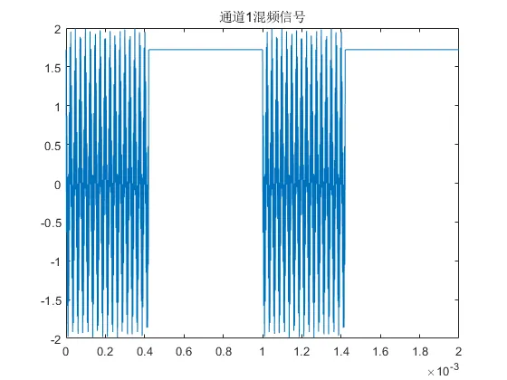

最近开始学毫米波雷达测角，先写了两个LFMCW雷达接收信号仿真的matlab函数：
- [lfmcw_signal_generator.m](https://github.com/Huffer342-WSH/myNotes/blob/main/radar/project/function/lfmcw_signal_generator.m) 返回每个通道的信号
- [lfmcw_radar_data_cube_generator.m](https://github.com/Huffer342-WSH/myNotes/blob/main/radar/project/function/lfmcw_radar_data_cube_generator.m) 返回雷达数据立方体

一般来说用第二个就可以了，第一个函数可以更直观的看到信号的波形，不过一般在radar-data-cebe的基础上做信号处理的，所以调用第二个函数就行了。

对应的demo如下

- [lfmcw_signal_generator_demo.m](https://github.com/Huffer342-WSH/myNotes/blob/main/radar/project/function/lfmcw_signal_generator_demo.m)
- [lfmcw_radar_data_cube_generator_demo.m](https://github.com/Huffer342-WSH/myNotes/blob/main/radar/project/function/lfmcw_radar_data_cube_generator_demo.m)

这里先贴一个第二个demo的运行结果
>坐标其实没算对，但也差不多吧
```matlab
% 这是预设的目标信息
% 一个初始位置[60,50],速度[0,-8]
% 第二个初始位置[20,0]，速度[10,0]
target_info = [[60 , 50 , 0, 0, -8, 0].', ...
                    [20, 0, 0, 10 , 0, 0].'];
```


## 概述

LFMCW雷达发射调频信号，接收到的信号和当前发射信号混频得到中频信号，ADC采集的就是混频后的中频信号。
> 一般会IQ混频采样（复采样），就是生成发射信号的时候在生成一个90°相位差的正交信号，分别和接收信号混频，得到的一两路数据正好拼成复数。

第一节讲了下LFMCW雷达发射信号的波形，第二节讲了下目标回波和混频。剩下的就是写的两个函数。


## 1.LFMCW雷达天线发射信号


LFMCW雷达发射信号在一个时长为 $T_{chrip}$ 的chrip内线性调频，两个chrip之间会间隔 $T_{idle}$的时间。一个chrip中发射信号的频率 $F_{t}$ 如下所示。

$$
F_{t}(t) = \begin{cases}
   f_{c} + \frac{B}{T_{chrip}}t  &, t<T_{chrip} \\
   f_{c}  &, t>T_{chrip}
\end{cases}
$$

其中  $f_{c}$ 为发射信号载波的频率， $B$ 为调制带宽。

依次得到发射信号的相位及其波形如下(只关注chrip的波形，忽略 $T_{idle}$ 中的部分 )：

$$
Ph_{t}(t) =2\pi( f_{c} t + \frac{B}{2 T_{chrip}}t^{2})
$$

$$
S_{t}(t) = e^{-j2\pi(f_{c} t + \frac{B}{2 T_{chrip}}t^{2})}
$$

根据以上内容编写一个计算发射信号相位的函数如下：

``` matlab
% 计算发射信号的相位
function signal = clac_Phase_tx(axis_t, fc, T_chrip, T_idle, slope)
    t = mod(axis_t, T_chrip + T_idle);
    signal = zeros(size(t));
    signal(t < T_chrip) = 2 * pi * (t(t < T_chrip) .* (fc + 0.5 * slope * t(t < T_chrip)));
    signal(t >= T_chrip) = 2 * pi * fc .* t(t >= T_chrip);
end
```

## 2.LFMCW雷达天线接收信号

天线接收到的回波信号是 $\tau$ 秒前的发射信号从发射天线出发经过目标发射后到达接收天线的信号，其相位就是 $Ph_{r}(t) = Ph_{t}(t - \tau)$。
雷达天线接收到目标的回波 $S_{r}(t)$ ， 接收到回波后会与当前时刻的接收发射信号下混频。 下混频这一过程相当于两个相位做差。 因此生成仿真信号，我们只需要计算发射信号接收信号的相位差即可。

首先用 ```target_info``` 保存目标的信息，```target_info``` 是一个 ```cell```数组 内部包含多个目标的信息，每一个目标的信息用一个长度为6的数组保存，前三位代表目标的初始位置，后三位代表目标的速度。

```matlab
target_info = {[20, 10, 0, 10, 5, 0], [40, -20, 0, -20, 10, 0]};
```

首先计算不同时刻目标的所在位置,并依此计算出大致的时间差 $\tau$
>  $t$ 时刻接收到的信号实际上是 $\tau / 2$ 秒前的目标反射来的信号，但是这个时间难以计算，因此把当前时刻目标的位置代替  $\tau / 2$ 秒前的目标的位置，对于速度比较慢的目标，这样的误差是可以接受的。

``` matlab
    % 计算不同时间的目标位置信息
    targets_pos = cell(size(target_info,2),1);
    for i = 1:size(target_info,2)
        r0 = target_info(1:3,i);
        v = target_info(4:6,i);
        targets_pos{i} = r0 + v * axis_t; % 目标位置，3×N矩阵，储存N个时刻的xyz坐标
    end

    % 计算不同通道在不同时间的延迟
    targets_delay = cell(numTx, numRx);
    for i = 1:numTx
        for j = 1:numRx
            targets_delay{i, j} = zeros(numTargets, length(axis_t));
            for k = 1:numTargets
                targets_delay{i, j}(k, :) = (vecnorm(targets_pos{k} - tx_pos(:,i), 2, 1) + vecnorm(targets_pos{k} - rx_pos(:,j), 2, 1)) / c;
            end
        end
    end
```

得到时间差后，就可以计算相位差和混频信号了。

``` matlab
    % 计算每个通道中每个目标的相位
    targets_phase = cell(numTx, numRx);
    for i = 1:numTx
        for j = 1:numRx
            targets_phase{i, j} = clac_Phase_tx(repmat(axis_t, numTargets, 1) - targets_delay{i, j}, Fc, T_chrip, T_idle, f_slope);

        end
    end
    tx_phase = clac_Phase_tx(axis_t, Fc, T_chrip, T_idle, f_slope);

    % 计算每个通道的接收信号
    channel_signal = cell(numTx, numRx);
    for i = 1:numTx
        for j = 1:numRx
            channel_signal{i, j} = sum(exp(1j * (targets_phase{i, j}-tx_phase  )), 1);
        end
    end
    ref_signal = exp(1j * (targets_phase{1, 1}-tx_phase));
```

在这里我们混频时是用的 **接收信号相位-当前发射信号相位** 的方式，这样混频会导致速度和距离都是负频率，但是保留了正常的空间信息。

相反，**当前发射信号相位-接收信号相位** 的方式，最后计算出来的目标角度是镜像的，但是速度和距离是正常的。

## 3.LFMCW接收信号

函数和使用案例代码的github地址如下：

[lfmcw_signal_generator.m](https://github.com/Huffer342-WSH/myNotes/blob/main/radar/project/function/lfmcw_signal_generator.m)

[lfmcw_signal_generator_demo.m](https://github.com/Huffer342-WSH/myNotes/blob/main/radar/project/function/lfmcw_signal_generator_demo.m)

### 函数

<details>
  <summary>点击展开 (貌似代码块多了后网页会很卡,所以收起来了)</summary>

``` matlab
function [channel_signal, ref_signal] = lfmcw_signal_generator(Fc, BW, T_chrip, T_idle, axis_t, tx_pos, rx_pos, target_info)
    % lfmcw_signal_generator  生成MIMO阵列接收信号混频后的中频信号
    % argument：
    %
    %  Fc     载波频率 (Hz)
    %  BW     带宽 (Hz)
    %  T_chrip   chirp持续时间 (s)
    %  T_idle  两个chirp之间的间隔时间 (s)
    %  axis_t  时间轴 (s)
    %  tx_pos  发射天线的位置,行数为3的二维矩阵，一列代表一个天线的位置 (xyz坐标)
    %  rx_pos  接收天线的位置,同上
    %  target_info 目标信息，每个目标用长度为6的数组表示，包含初始位置和速度
    %
    % return：
    %
    %  channel_signal 一个cell数组，每个元素对应一个通道的信号，大小为(numTx, numRx)
    %  ref_signal 第一个通道接受到的每一个信号源的信号
    %
    %  \remark
    %  - 函数计算不同目标在不同时间的位置、延迟、相位，然后生成信号。
    %  - 目标位置、延迟和相位是基于发射和接收天线的位置以及目标的速度计算得出的。
    % 建立坐标系时，按照右手螺旋原则，以雷达天线朝向为x轴正方向，，左侧为y轴正方向，上放为z轴正方向
    % 方位角：目标方向在xoy平面投影的角度，x轴正方向方位角为0°，y轴正方向方位角为90°
    % 俯仰角：目标方向和xoy平面的夹角，z轴正方向为90°俯仰角
    %   Example:
    %       BW = 250e6; %带宽
    %       Fc = 24e9; % 载波频率
    %       T_chrip = 420e-6; %  chirp 持续时间
    %       T_idle = 580e-6; % 两个chirp之间的间隔时间
    %       axis_t = 0:1/2.5e6:(T_chrip + T_idle) * 16; % 时间轴
    %       target_info = {[20, 10, 0, 10, 5, 0], [40, -20, 0, -20, 10, 0]};
    %       tx_pos = {[0, 1, 1], [0, 3, 1]};
    %       rx_pos = {[0, 0, 0], [0, 1, 0], [0, 2, 0]};
    %       [channel_signal, ref_signal] = lfmcw_signal_generator(Fc, BW, T_chrip, T_idle, axis_t, tx_pos, rx_pos, target_info);
    %       figure(1)
    %       subplot(211);
    %       plot(real(ref_signal(1, :)));
    %       subplot(212);
    %       plot(real(ref_signal(2, :)));
    arguments
        Fc double
        BW double
        T_chrip double
        T_idle double
        axis_t (1, :) double
        tx_pos (3, :) double
        rx_pos (3, :) double
        target_info (6, :) double
    end
    % 参数计算
    c = physconst('LightSpeed'); %光速
    f_slope = BW / T_chrip; %调频斜率

    numTx = size(tx_pos, 2);
    numRx = size(rx_pos, 2);
    numTargets = size(target_info, 2);

    % 计算不同时间的目标位置信息
    targets_pos = cell(size(target_info, 2), 1);
    for i = 1:size(target_info, 2)
        r0 = target_info(1:3, i);
        v = target_info(4:6, i);
        targets_pos{i} = r0 + v * axis_t; % 目标位置，3×N矩阵，储存N个时刻的xyz坐标
    end

    % 计算不同通道在不同时间的延迟
    targets_delay = cell(numTx, numRx);
    for i = 1:numTx
        for j = 1:numRx
            targets_delay{i, j} = zeros(numTargets, length(axis_t));
            for k = 1:numTargets
                targets_delay{i, j}(k, :) = (vecnorm(targets_pos{k} - tx_pos(:, i), 2, 1) + vecnorm(targets_pos{k} - rx_pos(:, j), 2, 1)) / c;
            end
        end
    end

    % 计算每个通道中每个目标的相位
    targets_phase = cell(numTx, numRx);
    for i = 1:numTx
        for j = 1:numRx
            targets_phase{i, j} = clac_Phase_tx(repmat(axis_t, numTargets, 1) - targets_delay{i, j}, Fc, T_chrip, T_idle, f_slope);

        end
    end
    tx_phase = clac_Phase_tx(axis_t, Fc, T_chrip, T_idle, f_slope);

    % 计算每个通道的接收信号
    channel_signal = cell(numTx, numRx);
    for i = 1:numTx
        for j = 1:numRx
            channel_signal{i, j} = sum(exp(1j * (targets_phase{i, j} - tx_phase)), 1);
        end
    end
    ref_signal = exp(1j * (targets_phase{1, 1} - tx_phase));

end

%% 计算相位函数
function signal = clac_Phase_tx(axis_t, fc, T_chrip, T_idle, slope)
    t = mod(axis_t, T_chrip + T_idle);
    signal = zeros(size(t));
    signal(t < T_chrip) = 2 * pi * (t(t < T_chrip) .* (fc + 0.5 * slope * t(t < T_chrip)));
    signal(t >= T_chrip) = 2 * pi * fc .* t(t >= T_chrip);
end

```
</details>


### demo
<details>
    <summary>Click to expand!</summary>

```matlab
clear; clc; close all
BW = 250e6; %带宽
Fc = 24e9; % 载波频率
T_chrip = 420e-6; %  chirp 持续时间
T_idle = 580e-6; % 两个chirp之间的间隔时间
Fs = 2.5e6;
numADC = 256; % # ADC采样点数/chrip
numChirps = 2; % # chrip/frame
numCPI = 1; % frame数量
axis_t = 0:1 / Fs:(T_chrip + T_idle) * numCPI * numChirps; % 时间轴
lambda = physconst('LightSpeed') / Fc;
d_rx = lambda / 2; % 接收天线之间的距离，单位米
d_tx = 4 * d_rx; % 发射天线之间的距离，单位米
numTx = 1; % 发射天线数量
numRx = 3; % 接收天线数量

% 目标初始化信息，每个目标用长度为6的列向量保存信息，前三位代表起始坐标，后三位代表速度。
target_info = [[10 * cosd(10), 10 * sind(10), 0, 0, 0, 0].', ...
                    [20 * cosd(-45), 20 * sind(-45), 0, 1 * cosd(-45), 1 * sind(-45), 0].'];
% 发射天线的位置，xyz坐标系
tx_pos = [zeros(1, numTx); linspace(-0.5, 0.5, numTx) * d_tx * (numTx - 1); zeros(1, numTx)];

% 接受天线的位置
rx_pos = [zeros(1, numRx); linspace(-0.5, 0.5, numRx) * d_rx * (numRx - 1); zeros(1, numRx)];

[channel_signal, ref_signal] = lfmcw_signal_generator(Fc, BW, T_chrip, T_idle, axis_t, tx_pos, rx_pos, target_info);

%% 绘制时域波形图

figure('Name', '单目标回波')
subplot(211);
plot(axis_t, real(ref_signal(1, :)));
title('目标1回波');
subplot(212);
plot(axis_t, real(ref_signal(2, :)));
title('目标2回波');
figure('Name', '通道1混频信号')
plot(axis_t, real(channel_signal{1, 1}));
title('通道1混频信号');


```





</details>


## 生成Radar-data-cube

[lfmcw_radar_data_cube_generator.m](https://github.com/Huffer342-WSH/myNotes/blob/main/radar/project/function/lfmcw_radar_data_cube_generator.m)

### 函数


<details>
  <summary>Click to expand!</summary>
  

```matlab
function varargout = lfmcw_radar_data_cube_generator(freq_carry, bandwidth, T_chrip, T_idle, T_nop, freq_sampling, numSampling, numChrip, numFrame, tx_pos, rx_pos, target_info)
    %
    % 生成MIMO雷达数据立方体，模拟中频信号经过混频后的接收信号
    %
    % 输入参数：
    %   Fc: 载波频率 (Hz)
    %   BW: 带宽 (Hz)
    %   T_chrip: chirp持续时间 (s)
    %   T_idle: 两个chirp之间的间隔时间 (s)
    %   T_nop: 空闲时间 (s)
    %   freq_sampling: 采样频率 (Hz)
    %   numSampling: chirp内采样点数
    %   numChrip: chirp序列数量
    %   numFrame: 帧数
    %   tx_pos: 发射天线位置 (3xnumTx矩阵，xyz坐标)
    %   rx_pos: 接收天线位置 (3xnumRx矩阵，xyz坐标)
    %   target_info: 目标信息 (6xn矩阵，每行表示一个目标的初始位置和速度)
    %
    % 输出参数：
    %   radar_data_cube: 数据立方体 (numFrame x numRx*numTx x numChrip x numSampling)
    %   res_range: 距离分辨率 (m)
    %   res_velocity: 速度分辨率 (m/s)
    %
    % 注释：
    %   - 根据目标信息、天线位置和时间轴计算目标位置、延迟和相位
    %   - 基于右手螺旋坐标系，x轴正向，y轴左侧，z轴上方
    %   - 方位角：目标方向在xoy平面的投影角度
    %   - 俯仰角：目标方向与xoy平面的夹角
    %
    % EXAMPLE:
    %   bandWidth = 250e6; %带宽
    %   fc = 24e9; % 载波频率
    %   T_chrip = 420e-6; %  chirp 持续时间
    %   T_idle = 580e-6; % 两个chirp之间的间隔时间
    %   Fs = 6e5;
    %   numSampling = 256; % # ADC采样点数/chrip
    %   numChrip = 32; % # chrip/frame
    %   numFrame = 16; % frame数量
    %   numTx = 1; % 发射天线数量
    %   numRx = 8; % 接收天线数量
    %   d_rx = lambda / 2; % 接收天线之间的距离，单位米
    %   d_tx = 4 * d_rx; % 发射天线之间的距离，单位米
    %   % 目标初始化信息，每个目标用长度为6的列向量保存信息，前三位代表起始坐标，后三位代表速度。
    %   target_info = [[10 * cosd(10), 10 * sind(10), 0, 0, 0, 0].', ...
    %                       [80 * cosd(-45), 80 * sind(-45), 0, 10 * cosd(-45), 10 * sind(-45), 0].'];
    %   % 发射天线的位置，xyz坐标系
    %   tx_pos = [zeros(1, numTx); linspace(-0.5, 0.5, numTx) * d_tx * (numTx - 1); zeros(1, numTx)];
    %   % 接受天线的位置
    %   rx_pos = [zeros(1, numRx); linspace(-0.5, 0.5, numRx) * d_rx * (numRx - 1); zeros(1, numRx)];
    %   radar_data_cube = lfmcw_radar_data_cube_generator(fc, bandWidth, T_chrip, T_idle, 0.4, Fs , numSampling, numChrip, numFrame, tx_pos, rx_pos, target_info);

    arguments
        freq_carry double
        bandwidth double
        T_chrip double
        T_idle double
        T_nop double
        freq_sampling double
        numSampling double
        numChrip double
        numFrame double
        tx_pos (3, :) double
        rx_pos (3, :) double
        target_info (6, :) double
    end

    % 参数计算
    c = physconst('LightSpeed'); %光速
    f_slope = bandwidth / T_chrip; %调频斜率

    numTx = size(tx_pos, 2);
    numRx = size(rx_pos, 2);
    numTargets = size(target_info, 2);

    t = T_chrip - (numSampling - 1) / freq_sampling;

    if (t < 0)
        error("chrip时长需要大于 (numSampling - 1) / freq_sampling")
    end
    axis_4 = (0:numSampling - 1) ./ freq_sampling +t / 2;
    axis_3 = (0:numChrip - 1) .* (T_chrip + T_idle);
    axis_2 = (0:numFrame -1) .* (T_nop +numChrip * (T_chrip + T_idle));
    axis_t = kron(axis_3, ones(1, numSampling)) + repmat(axis_4, 1, numChrip);
    axis_t = kron(axis_2, ones(size(axis_t))) + repmat(axis_t, 1, numFrame);

    % 计算不同时间的目标位置信息
    targets_pos = zeros([numTargets, 3, size(axis_t, 2)]);
    for i = 1:size(target_info, 2)
        r0 = target_info(1:3, i);
        v = target_info(4:6, i);
        targets_pos(i, :, :) = r0 + v * axis_t; % 目标位置，3×N矩阵，储存N个时刻的xyz坐标
    end

    % 计算不同通道在不同时间的延迟
    targets_delay = zeros([numRx * numTx, numTargets, size(axis_t, 2)]);
    for i = 1:numTx
        for j = 1:numRx
            for k = 1:numTargets
                targets_delay((i - 1) * numRx + j, k, :) = (vecnorm(squeeze(targets_pos(k, :, :)) - tx_pos(:, i), 2, 1) + vecnorm(squeeze(targets_pos(k, :, :)) - rx_pos(:, j), 2, 1)) / c;
            end
        end
    end

    % 计算每个通道中每个目标的相位
    targets_phase = zeros([numRx * numTx, numTargets, size(axis_t, 2)]);
    for i = 1:numTx
        for j = 1:numRx
            targets_phase((i - 1) * numRx + j, :, :) = clac_Phase_tx(repmat(axis_t, numTargets, 1) - squeeze(targets_delay((i - 1) * numRx + j, :, :)), freq_carry, T_chrip, T_idle, T_nop, numChrip, f_slope);

        end
    end
    tx_phase = clac_Phase_tx(axis_t, freq_carry, T_chrip, T_idle, T_nop, numChrip, f_slope);

    % 计算每个通道的接收信号
    channel_signal = zeros([size(axis_t, 2), numRx * numTx]);
    for i = 1:numTx
        for j = 1:numRx
            channel_signal(:, (i - 1) * numRx + j) = sum(exp(1j * (squeeze(targets_phase((i - 1) * numRx + j, :, :)) - tx_phase)), 1);
        end
    end
    % ref_signal = exp(1j * (targets_phase(1, 1, :, :) - tx_phase));

    radar_data_cube = reshape(channel_signal, [numSampling, numChrip, numFrame, numRx * numTx]);
    radar_data_cube = permute(radar_data_cube, [3, 4, 2, 1]);
    useful_bandwidth = (numSampling - 1) / freq_sampling * f_slope;
    res_range = c / (2 * useful_bandwidth);
    res_velocity = physconst('LightSpeed') / (2 * freq_carry * (T_chrip + T_idle) * numChrip);
    % 确定输出的数量
    nargoutchk(0, 3); % 检查输出参数的数量，最多支持3个

    % 分配输出参数
    switch nargout
        case 1
            varargout{1} = radar_data_cube;
        case 2
            varargout{1} = radar_data_cube;
            varargout{2} = res_range;
        case 3
            varargout{1} = radar_data_cube;
            varargout{2} = res_range;
            varargout{3} = res_velocity;
        otherwise
            error('Too many output arguments');
    end

end

%% 计算相位函数
function signal = clac_Phase_tx(axis_t, fc, T_chrip, T_idle, T_nop, numChrip, slope)
    t = mod(axis_t, (T_chrip + T_idle) * numChrip + T_nop);
    t = mod(t, T_chrip + T_idle);
    signal = 2 * pi * (t .* (fc + 0.5 * slope * t));
end
```

</details>


### demo

里面还用了一些其他函数，我建议直接去github全部下载下来。
这个是雷达相关的文件的根目录：[https://github.com/Huffer342-WSH/myNotes/tree/main/radar](https://github.com/Huffer342-WSH/myNotes/tree/main/radar)

用到的函数:
- [helperPlotSpec.m](https://github.com/Huffer342-WSH/myNotes/blob/main/radar/project/function/helperPlotSpec.m)
- [helperPlotSpec2d.m](https://github.com/Huffer342-WSH/myNotes/blob/main/radar/project/function/helperPlotSpec2d.m)
- [steering_vector.m](https://github.com/Huffer342-WSH/myNotes/blob/main/radar/project/function/steering_vector.m)
- [printVar.m](https://github.com/Huffer342-WSH/myNotes/blob/main/radar/project/function/printVar.m)

其中生成导向矢量的函数[steering_vector.m](https://github.com/Huffer342-WSH/myNotes/blob/main/radar/project/function/steering_vector.m)可以看一下这个文章[《到达矢量 (Arrival vector)》](https://huffer342-wsh.github.io/posts/radar/arrival-vector)


```matlab
%%
clear; clc; close all
bandWidth = 250e6; %带宽
fc = 24e9; % 载波频率
T_chrip = 420e-6; %  chirp 持续时间
T_idle = 580e-6; % 两个chirp之间的间隔时间
T_nop = 0.4;
Fs = 2.5e6;
SNR = 10; % 噪声信号比

numADC = 256; % # ADC采样点数/chrip
numChirps = 32; % # chrip/frame
numCPI = 30; % frame数量
numTx = 1; % 发射天线数量
numRx = 8; % 接收天线数量
numChannel = numTx * numRx;

max_range = 255 * physconst('LightSpeed') / 2 / (bandWidth * numADC * (1 / Fs) * 4 / T_chrip);
max_velocity = (numChirps - 1) * physconst('LightSpeed') / (2 * fc * (T_chrip + T_idle) * numChirps);
axis_t = 0:1 / Fs:(T_chrip + T_idle) * numCPI * numChirps; % 时间轴
axis_range = (255:-1:0) * physconst('LightSpeed') / 2 / (bandWidth * numADC * (1 / Fs) * 4 / T_chrip); %输入信号混频后是负频率，因此坐标轴反向
axis_velocity = (floor(numChirps / 2):-1: - floor(numChirps / 2) + 1) / (numChirps - 1) * max_velocity;
axis_angle = (-90:1:90);

lambda = physconst('LightSpeed') / fc;
d_rx = lambda / 2; % 接收天线之间的距离，单位米
d_tx = 4 * d_rx; % 发射天线之间的距离，单位米

% 目标初始化信息，每个目标用长度为6的列向量保存信息，前三位代表起始坐标，后三位代表速度。
target_info = [[60 , 50 , 0, 0, -8, 0].', ...
                    [20, 0, 0, 10 , 0, 0].'];
% 发射天线的位置，xyz坐标系
tx_pos = [zeros(1, numTx); linspace(-0.5, 0.5, numTx) * d_tx * (numTx - 1); zeros(1, numTx)];

% 接受天线的位置
rx_pos = [zeros(1, numRx); linspace(-0.5, 0.5, numRx) * d_rx * (numRx - 1); zeros(1, numRx)];

radar_data_cube = lfmcw_radar_data_cube_generator(fc, bandWidth, T_chrip, T_idle, T_nop, Fs / 4, numADC, numChirps, numCPI, tx_pos, rx_pos, target_info);

%% 添加噪声
k = mean(abs(radar_data_cube), 'all') / (10 ^ (SNR / 20));
radar_data_cube = radar_data_cube + k * (1j .* randn(size(radar_data_cube)) + 1 .* randn(size(radar_data_cube)));

%% 距离维FFT
rangeFFT = fft(radar_data_cube, 256, 4);

%% 绘制 RDM

% figure('Name', 'RDM')
% for i = 1:1
%     rdm = squeeze(radar_data_cube(1,i,:, :));
%     spec = fftshift(fft2(rdm, 32, 256), 1);
%     h = imagesc( axis_range,axis_velocity, abs(spec));
%     drawnow;
%     pause(0.1);
% end
%% 初始化matlab phased 工具箱 变量
phased_ula = phased.ULA('NumElements', numRx * numTx, 'ElementSpacing', d_rx);

%% 导向矢量矩阵 （MVDR和MUSIC通用）
steering_vectors = steering_vector(rx_pos, [axis_angle; zeros(size(axis_angle))], lambda);

%% 取出一帧数据
frame = squeeze(radar_data_cube(1, :, :, :));
x = squeeze(mean(frame(:, 1:1, :), 2)); %累计不同chrip的信号（高速运动的目标累积可能会带来角度模糊）
x = x - mean(x, 2); % 减去均值
Cxx = x * x';
%% Capon算法测角——matlab工具箱 phased.MVDRBeamformer

mvdrspatialspect = phased.MVDREstimator('SensorArray', phased_ula, ...
    'OperatingFrequency', fc, 'ScanAngles', axis_angle, ...
    'DOAOutputPort', true, 'NumSignals', 2);
[matlab_mvdr_spec, target_angs] = mvdrspatialspect(x.');

disp("Phased 工具箱MVDR算法检测到的目标角度:");
printVar(target_angs);

% figure("Name", 'MVDR 谱 (MATLAB函数)');
% helperPlotSpec(axis_angle, matlab_mvdr_spec, 'MVDR 谱 (MATLAB函数)');

%% Capon算法测角——自己实现

my_mvdr_spec = 1 ./ sum(steering_vectors' / Cxx .* steering_vectors.', 2);
my_mvdr_spec = sqrt(abs(my_mvdr_spec));
figure("Name", "Capon 算法测角")
hold on;
helperPlotSpec(axis_angle, matlab_mvdr_spec, 'MVDR 谱 (MATLAB函数)');
helperPlotSpec(axis_angle, my_mvdr_spec, 'MVDR 谱 (自己实现)', 'r*');
hold off;

%% MVDR 波束成型还原输入信号
[peaks, locs] = findpeaks(my_mvdr_spec, 'SortStr', 'descend');
peaks = peaks(1:2);
locs = locs(1:2);

strvec = steering_vectors(:, locs);

y = strvec' * x;

figure, plot(real(y(1, :)));
figure, plot(real(y(2, :)));

%% MUSIC算法 直接测角
% 系统的输入信号 $x(n)$

[Qn, P] = getNoiseSpace(Cxx);
my_music_spec = 1 ./ (sum(abs((steering_vectors' * Qn)) .^ 2, 2));
my_music_spec = sqrt(my_music_spec);

% figure("Name", "MUSIC 算法测角")
% helperPlotSpec(axis_angle, my_music_spec, 'MUSIC 谱 (自己实现)');

%% 使用matlab的musicdoa()函数测角
% [doas,spec,specang] = (covmat,nsig ,'ScanAngles',scanangle)
% covmat: 协方差矩阵
% nsig  : 信号个数
% scanangle : 扫描角度数组
% doas  : 目标角度
% spec  : MUSIC伪谱
% specang ：角度坐标轴

[doas, matlab_music_spec, specang] = musicdoa(Cxx, 2, 'ScanAngles', axis_angle, 'ElementSpacing', 0.5);
printVar("musicdoa()检测到的目标角度:", doas);

figure("Name", "MUSIC 算法测角")
hold on;
helperPlotSpec(axis_angle, my_music_spec, 'MUSIC 谱 (自己实现)');
helperPlotSpec(axis_angle, matlab_music_spec, 'MUSIC 谱 (Matlab 函数)', 'r*');
hold off;

%% MUSIC算法 距离维度分离后测角
frame = squeeze(radar_data_cube(1, :, :, :));
frame = fft(frame, 256, 3);
range_az_music = zeros(numADC, length(axis_angle));
for i = 1:numADC
    x = squeeze(frame(:, :, i));
    Cxx = x * x';
    [Qn, P] = getNoiseSpace(Cxx);
    range_az_music(i, :) = P ./ (sum(abs((steering_vectors' * Qn)) .^ 2, 2));
end

figure('Name', 'MUSIC 距离-角度谱')
helperPlotSpec2d(axis_angle, axis_range, range_az_music, 'Range-Angle Map');

%% Cpaon算法 距离维度分离后测角
frame = squeeze(radar_data_cube(1, :, :, :));
frame = fft(frame, 256, 3);
range_az_mvdr = zeros(numADC, length(axis_angle));
for i = 1:numADC
    x = squeeze(frame(:, :, i));
    Cxx = x * x';
    [Qn, P] = getNoiseSpace(Cxx);
    range_az_mvdr(i, :) = 1 ./ abs(sum(steering_vectors' / Cxx .* steering_vectors.', 2));
end

figure('Name', 'MUSIC 距离-角度谱')
helperPlotSpec2d(axis_angle, axis_range, range_az_mvdr, 'Capon');


%% 绘制gif
% 初始化图形窗口
figure('Name', 'MUSIC 距离-角度谱');

% 初始化存储图像数据的cell数组
images = {};

% 定义 GIF 文件名
gif_filename = 'mvdr_spectrum.gif';

% 预先设置统一的颜色映射和颜色范围
caxis_range = [0 6e5]; % 根据你的数据范围选择合适的颜色范围
[Theta, Rho] = meshgrid(axis_angle, axis_range);
[X, Y] = pol2cart(Theta/180*pi, Rho);
for f = 1:numCPI
    frame = squeeze(radar_data_cube(f, :, :, :));
    frame = fft(frame, 256, 3);
    range_az_mvdr = zeros(numADC, length(axis_angle));

    for i = 1:numADC
        x = squeeze(frame(:, :, i));
        Cxx = x * x';
        [Qn, P] = getNoiseSpace(Cxx);
        range_az_mvdr(i, :) = 1 ./ abs(sum(steering_vectors' / Cxx .* steering_vectors.', 2));
    end
    
    % 绘制当前帧
    % imagesc(axis_angle, axis_range, range_az_mvdr);
    surf(X, Y, range_az_mvdr, 'EdgeColor', 'none');
    xlim([0,200]);
    ylim([-200,200]);
    daspect([1,1,1]);
    view(2); % 俯视图
    colorbar;
    xlabel('X');
    ylabel('Y');
    title(['Time ', num2str((f-1)*((T_chrip+T_idle)*numChirps+T_nop))]);
    clim(caxis_range); % 设置颜色范围
    drawnow;
    
    % 捕获当前图像帧
    frame = getframe(gcf);
    img = frame2im(frame);
    [imind, cm] = rgb2ind(img, 256);

    % 将图像写入 GIF 文件
    if f == 1
        imwrite(imind, cm, gif_filename, 'gif', 'Loopcount', inf, 'DelayTime', 0.1);
    else
        imwrite(imind, cm, gif_filename, 'gif', 'WriteMode', 'append', 'DelayTime', 0.1);
    end
end


%% MUSIC算法——分离噪声子空间
function [Un, P] = getNoiseSpace(Rxx)
    [V, D] = eig(Rxx); % Q: eigenvectors (columns), D: eigenvalues
    [D, I] = sort(diag(D), 'descend');
    V = V(:, I);
    th = mean(D);
    i = 1;
    while D(i) > th
        i = i + 1;
    end
    Un = V(:, i:end);
    P = sum(D(1:i - 1));
end
```

在贴一遍这个图，其他图自己跑代码吧


