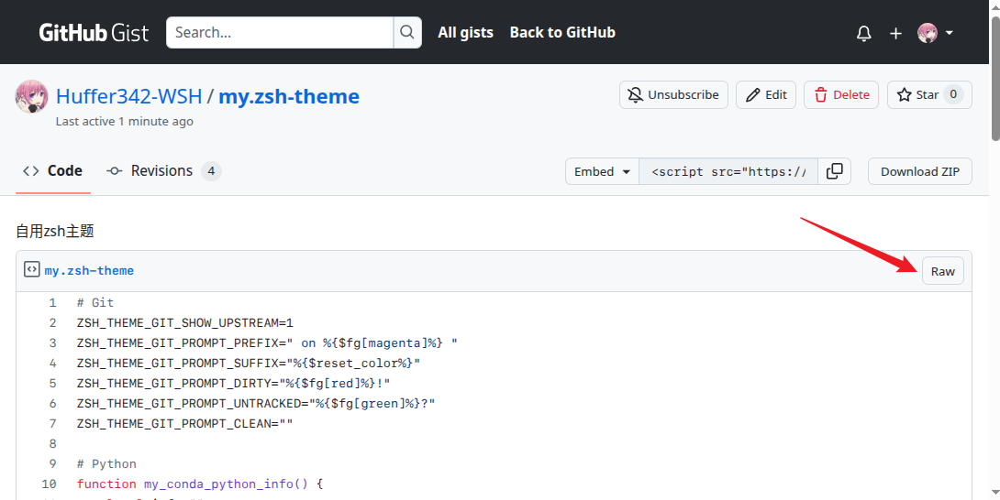

## 问题

在Gist网页上点击raw得到的原始文件URL是指向固定版本的而不是最新版本，不像Github上点击raw会得到一个只想head的URL

例如：

[https://gist.githubusercontent.com/Huffer342-WSH/452c50b3172bf5857927e76626b5af06/raw/~~03e858c1ec932f0a8fafae514d9ad9f11bc65fa4~~/my.zsh-theme](https://gist.githubusercontent.com/Huffer342-WSH/452c50b3172bf5857927e76626b5af06/raw/03e858c1ec932f0a8fafae514d9ad9f11bc65fa4/my.zsh-theme)

此时去掉`raw/`和`my.zsh-theme`中间的哈希值`03e858c1ec932f0a8fafae514d9ad9f11bc65fa4/`就可以得到指向最新版本文件的URL

[https://gist.githubusercontent.com/Huffer342-WSH/452c50b3172bf5857927e76626b5af06/raw/my.zsh-theme](https://gist.githubusercontent.com/Huffer342-WSH/452c50b3172bf5857927e76626b5af06/raw/my.zsh-theme)

## URL组成

可以看出Gist上文件的URL实际组成是这样的：

| 组成部分        | 对应内容                                   |
| :-------------- | :----------------------------------------- |
| **协议与域名**  | `https://gist.githubusercontent.com`       |
| **Gist ID**     | `452c50b3172bf5857927e76626b5af06`         |
| **Raw 标识符**  | `raw`                                      |
| **Commit Hash** | `03e858c1ec932f0a8fafae514d9ad9f11bc65fa4` |
| **文件名**      | `my.zsh-theme`                             |

---

**文件URL - 最新版本**

`https://gist.githubusercontent.com`/**`[用户名]`**/**`[Gist ID]`**/`raw`/**`[文件名]`**

**文件URL - 指定版本**

`https://gist.githubusercontent.com`/**`[用户名]`**/**`[Gist ID]`**/`raw`/**`[Commit Hash]`**/**`[文件名]`**

**网页URL - 最新版本**

`https://gist.github.com`/**`[用户名]`**/**`[Gist ID]`**

**网页URL - 指定版本**

`https://gist.github.com`/**`[用户名]`**/**`[Gist ID]`**/**`[Commit Hash]`**
