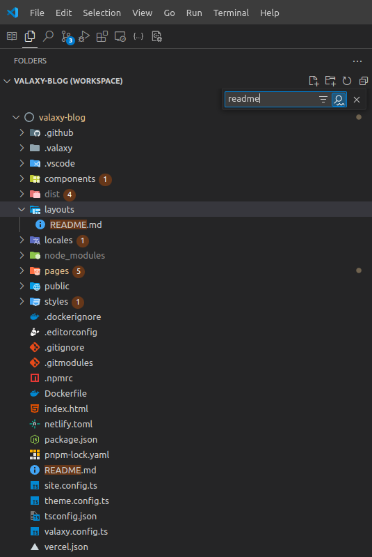
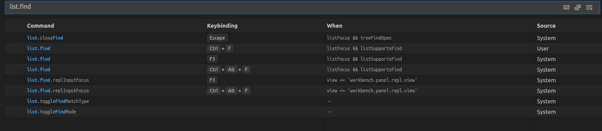

  

在文件列表中所搜文件的功能以前是快捷键`Ctrl+F`， 在VSCode的一次更新后快捷键变成了`Ctrl+Alt+F`。具体见[https://code.visualstudio.com/updates/v1_89#_find-in-trees-keybinding](https://code.visualstudio.com/updates/v1_89#_find-in-trees-keybinding)

想要修改快捷键先依次按下`Ctrl+K`,`Ctrl+S`打开快捷键设置，然后呢搜索`list.find`

