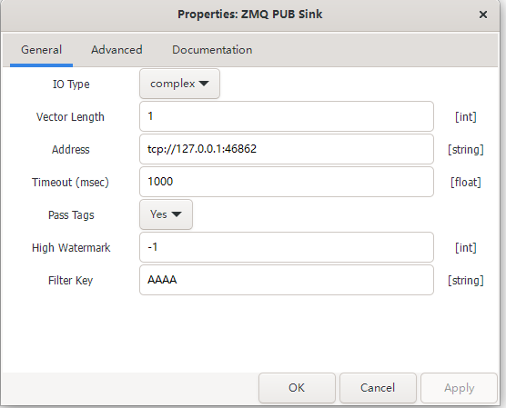
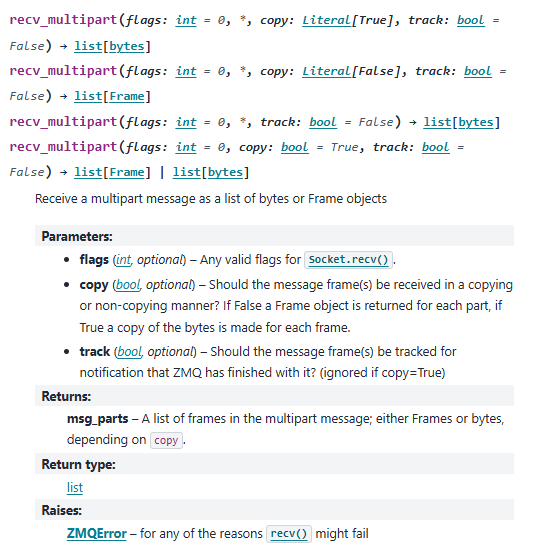
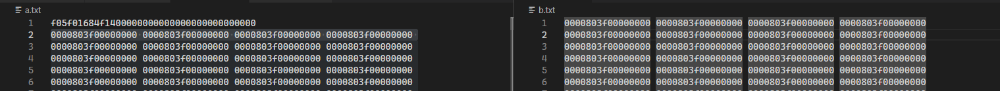

GNU-Radio中可以用ZMQ模块实时输数据给其他程序，相比UDP模块更加稳定。



GNU-Radio中的ZMQ模块可以设置"Pass Tags"和"Filter Key",官网的描述如下:

>Wire Format
>The ZMQ stream blocks have the option to pass tags. In addition, the PUB/SUB blocks support filtering. Both of these options affect the ZMQ wire protocol.
>When a filter string is supplied to a PUB/SUB block, GNU Radio uses multi-part messages to send the filter string, followed by the payload. Non-GNU Radio code attempting to interface with GNU Radio ZMQ blocks must be prepared for this part, and discard it. Note that the sender only sends this message part if a non-empty filter has been specified.
>Next, if sending tags is enabled, any tags within the window of the data to be sent are encoded in a special format and prepended to the payload data. If tags are not enabled, this header is elided.
>These two features make matching the sender configuration to the receiver configuration essential. Failure to do so will cause runtime errors in your flowgraph.

文中提到了"Filter Key"是用ZMQ的"multi-part messages"来发送的，pyZMQ中提供的方法如下：


测试了一下返回值如下图，可以看到我设置的'AAAA'被列出来了，很可惜"Pass Tags"还是和发送的数据连在一起。

```
 [b'AAAA', b'\xf0_\x01g\xe6G\x01\x00\x00\x00\x00\x00\x00\x00\x00\x00\x00\x00\x00\x00\x00\x80?\x00\x00\x0  ....]
```

## 解析Pass Tags

首先用GNU-Radio发送直流信号(常数)，对比"Pass Tags"有没有的区别。



左半边是设置了"Pass Tags"的，右半边是没设置"Pass Tags"的。可以看到"Pass Tags"在头部额外添加了一段数据，共19Bytes：
```
f05f01684f1400000000000000000000000000
```

多接收几组数据看看"Pass Tags"

```
长度（Bytes）                 Pass Tags
  32783         f05f0159df2c00000000000000000000000000
  32787         f05f0158ff2c00000000000000000000000000
  32783         f05f01581f2d00000000000000000000000000
  32787         f05f01573f2d00000000000000000000000000
  32783         f05f01575f2d00000000000000000000000000
  32787         f05f01567f2d00000000000000000000000000
  32783         f05f01569f2d00000000000000000000000000
  32787         f05f0155bf2d00000000000000000000000000
  32783         f05f0155df2d00000000000000000000000000
  65551         f05f0154ff2d00000000000000000000000000
  32787         f05f01533f2e00000000000000000000000000
```

大致可以看出前面一段`f05f015`是固定的，后面的是数据的序号。不过GNU-Radio是开源的，所以不如直接翻翻源码。

从`push_sink_impl.cc`模块一步一步下翻就能找到`gnuradio-3.10.10.0/gr-zeromq/lib/tag_headers.cc:31 std::string gen_tag_header(uint64_t offset, std::vector<gr::tag_t>& tags)`，这个函数用来生成Pass Tags的。

```c
#define GR_HEADER_MAGIC 0x5FF0
#define GR_HEADER_VERSION 0x01

std::string gen_tag_header(uint64_t offset, std::vector<gr::tag_t>& tags)
{
    std::stringbuf sb("");
    std::ostream ss(&sb);

    uint16_t header_magic = GR_HEADER_MAGIC;
    uint8_t header_version = GR_HEADER_VERSION;
    uint64_t ntags = (uint64_t)tags.size();

    ss.write((const char*)&header_magic, sizeof(uint16_t));
    ss.write((const char*)&header_version, sizeof(uint8_t));
    ss.write((const char*)&offset, sizeof(uint64_t));
    ss.write((const char*)&ntags, sizeof(uint64_t));

    for (size_t i = 0; i < tags.size(); i++) {
        ss.write((const char*)&tags[i].offset, sizeof(uint64_t));
        pmt::serialize(tags[i].key, sb);
        pmt::serialize(tags[i].value, sb);
        pmt::serialize(tags[i].srcid, sb);
    }

    return sb.str();
}
```

可以看到头部共19个字节，分别为2字节0x5FF0，1个字节0x01，8个字节offset，8个字节ntags。
用上面的数据看一下：
```
  32783         f05f0159df2c00000000000000000000000000
  32787         f05f0158ff2c00000000000000000000000000
```

把offset部分提取出来,数据是小端格式的，得到的数据如下：
```
59df2c0000000000 --> 2940761
58ff2c0000000000 --> 2948952
```
观察一下offset的变化，我传输的是float类型的数据，正好对应一个元素4字节。
$$
\begin{align*}
2948952 - 2940761 = 8191 \\
32783 = 19 + 8191 \times 4\\
\end{align*}
$$

再传输一下complex数据试试，一个元素应该是8字节。
```
32779 f05f01ef6ca804000000000000000000000000
32787 f05f01ee7ca804000000000000000000000000

78150894-78146799 = 4095
32779 = 19 + 4095 * 8
```
