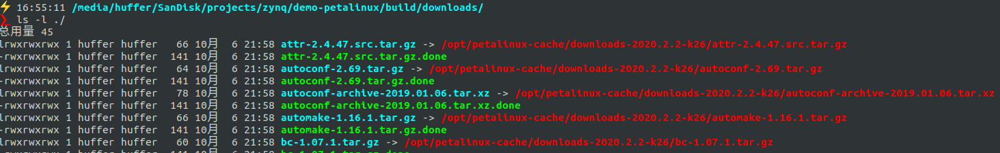

## 1. 激活环境

在petalinux的安装目录下有一个`setting.sh`脚本用于激活环境
```shell
source <petalinux安装路径>/setting.sh
```

为了方便管理不同环境，我使用一个`actv`函数来激活环境，将一下内容保存到脚本中，如`/opt/activate.sh`,然后再`~/.bashrc`里面添加如下`source /opt/activate.sh`,这样就可以在打开的终端中使用`actv`指令了来激活环境了

```shell
# 定义 actv 函数
actv() {
    arg=$1
    set -- # 重置shell参数
    case "$arg" in
        "petalinux-2020.2")
            source /opt/Xilinx/petalinux/2020.2/settings.sh
            ;;
        "xilinx-2020.2")
            source /opt/Xilinx/Vivado/2020.2/settings64.sh 
            ;;
        *)
            echo "Unknown command."
            ;;
    esac
}

# 定义 actv 的补全选项
_actv_completions() {
    # 仅在第一个参数时提供补全
    if [[ $COMP_CWORD -eq 1 ]]; then
        local cur=${COMP_WORDS[COMP_CWORD]}
        local commands="petalinux-2020.2 xilinx-2020.2"
        COMPREPLY=( $(compgen -W "$commands" -- "$cur") )
    else
        COMPREPLY=()  # 在后续的参数中不提示任何补全
    fi
}

# 为 actv 函数启用补全
complete -F _actv_completions actv
```


## 2. 创建petalinux工程

```shell
petalinux-create -t project -n  <PROJECT> --template  <TEMPLATE:versal|zynqMP|zynq|microblaze>                 
```

- `<PROJECT>`为工程名，使用指令后会在当前工作路径下创建一个同名文件夹存放工程,
- `<TEMPLATE:versal|zynqMP|zynq|microblaze>`为工程模板，按照自己用的器件选择

**例如**
```sh
petalinux-create -t project -n demo-zynq7010-petalinux --template zynq
cd ./demo-zynq7010-petalinux
```

## 3. 配置工程

配置工程分三个部分: `获取硬件描述`、`配置linux内核`、`配置rootfs`。 一般因为国内网络问题，还要加一步`设置sstate-cache本地路径、配置BitBake镜像`。

### 3.1 获取硬件描述并配置工程

Vivado中完成硬件配置后，假如要进一步开发PS端裸机程序或者linux程序，就需要导出硬件,在菜单栏选择`File > Export > Export hardware`,可以导出一个`.xsa`压缩包。里面包含PL端的比特流文件还有PS的初始化代码以及一些外设的信息。我们自己用AXI-Lite挂载到PS端的寄存器的信息都会包括在里面。

petalinux通过以下指令获取硬件描述，`.xsa`中的内容会同步到`./project-spec/hw-description/` 目录下

```shell
# 直接指定.xsa文件的路径
petalinux-config --get-hw-description <Vivado_Export_to_SDK_Directory>/system.xsa

# 指定 <Export hardware> 时选择的目录
petalinux-config --get-hw-description=<Vivado_Export_to_SDK_Directory>

# 或者工程目录下就有.xsa文件
petalinux-config --get-hw-description 
```

获取一次硬件描述后，之后只需要`petalinux-config`指令就可以打开配置界面

**常见配置：**
1. 选择根文件系统类型，决定启动方式（jtag/sd卡/nfs）
    
    `misc/config System → Image Packaging Configuration → Root filesystem type`

2. 设置linux内核源码；可以使用petalinux内置的也可以使用其他路径下的源码

    - `Linux Components Selection → linux-kernel`菜单下选择 `ext-local-src`
    - 设置路径 `Linux Components Selection → External linux-kernel local source settings`


### 3.2 设置本地sstate-cache和BitBake镜像

因为网络问题，将sstate-cache和BitBake镜像都设置成本地的会更方便，即使网好我也建议设置到本地，因为设置成本地petalinux会创建软链接，而不是把文件下载下来，可以省很多空间。[下载地址](https://china.xilinx.com/support/download/index.html/content/xilinx/zh/downloadNav/embedded-design-tools/archive.html)




#### 3.2.1 设置BitBake本地镜像

`petalinux-config`指令打开menuconfig界面，进入到`Yocto Settings → Add pre-mirror url`，填入'file://<本地地址>'，比如我下载下来的解压到了`/opt/petalinux-cache/downloads-2020.2.2-k26`目录，那我填入的就是：
```shell
file:///opt/petalinux-cache/downloads-2020.2.2-k26
```

然后在`project-spec/meta-user/conf/petalinuxbsp.conf`文件中添加如下内容
```
PREMIRRORS_prepend = " \
git://.*/.* file:///opt/petalinux-cache/downloads-2020.2.2-k26 \n \
gitsm://.*/.* file:///opt/petalinux-cache/downloads-2020.2.2-k26 \n \
ftp://.*/.* file:///opt/petalinux-cache/downloads-2020.2.2-k26 \n \
http://.*/.* file:///opt/petalinux-cache/downloads-2020.2.2-k26 \n \
https://.*/.* file:///opt/petalinux-cache/downloads-2020.2.2-k26 \n"
```

#### 3.2.2 设置本地sstate路径
`petalinux-config`指令打开menuconfig界面，进入到`Yocto Settings → Local sstate feeds settings `,填入下载的sstate-cache工件解压地址，比如我是
```
/opt/petalinux-cache/sstate_arm_2020.2/arm
```

然后把`Yocto Settings → Enable Network sstate feeds`取消掉就可以。

注意解压出来的文件夹是sstate_arm_2020.2，里面还有子文件夹，选自己使用芯片的架构。比如Zynq-7000的Cortex-A9是arm，Zynq UltraScale+ MPSoC的Cortex-A53是aarch64。

### 3.3 配置kernel


使用以下指令，会在编译一部分组件后打开内核配置界面
```shell
petalinux-config -c kernel
```

### 3.4 配置rootfs


```shell
petalinux-config -c rootfs
```

**常用选项**


## 4. 配置设备树

ZYNQ往往在PL端有自己设计的硬件，需要配置设备树，在`project-spec/meta-user/recipes-bsp/device-tree/files/`路径下

## 5. 编译工程

```
petalinux-build
```


## 6. 打包 BOOT.bin 启动文件
```shell
petalinux-package --boot --fsbl --fpga --u-boot 
```

ZynqMP平台还要加上`--pmufw`
```
petalinux-package --boot --fsbl --fpga --u-boot --pmufw
```

将`linux/image`文件中的BOOT.bin、boot.scr和image.ub拷贝到SD卡的boot分区即可。三个文件的作用如下：

- **BOOT.BIN**：这是启动二进制文件，通常包含以下内容：
   - **FSBL（First Stage Bootloader）**：负责初始化硬件并加载第二阶段引导程序。
   - **Bitstream**：用于配置FPGA。
   - **U-Boot**：作为第二阶段引导程序，负责加载操作系统内核。

- **boot.scr**：这是一个U-Boot脚本文件，包含启动命令。它告诉U-Boot如何加载和启动Linux内核以及其他必要的组件。

- **image.ub**：这是一个包含Linux内核、设备树和根文件系统的统一镜像文件。U-Boot根据`boot.scr`中的指令加载并启动这个镜像文件。

# 7. 构建SDK

```sh
petalinux-build --sdk
```

setenv bootargs 'console=ttyPS0,115200 root=/dev/mmcblk0p2 rootwait rw rootfstype=ext4'

# 8. 打包工程

**打包工程成.BSP**
```sh
petalinux-package --bsp -p <PATH_TO_PROJECT> --output MY.BSP
```

**从BSP创建工程**
```sh
petalinux-create -t project -s <path-to-bsp>
```

详见[《PetaLinux Tools Documentation: Reference Guide (UG1144)
》-- BSP Packaging](https://docs.amd.com/r/2020.2-English/ug1144-petalinux-tools-reference-guide/Steps-for-BSP-Packaging)：
