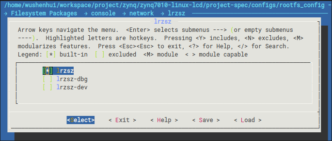

开发板在没有网的情况下就只能用串口传文件了，因为串口是用来与终端通信了，所以可以用lrzsz来传文件。

petalinux在制作rootfs时可以添加很多软件，做出来的镜像启动后就能直接用这些程序。lrzsz也是可选项，添加lrzsz的步骤如下：

1. 打开配置菜单
   ```shell
   petalinux-config -c rootfs
   ```

2. 进入目录`Filesystem Packages  → console  → network  → lrzsz`，把`lrzsz`勾上。


